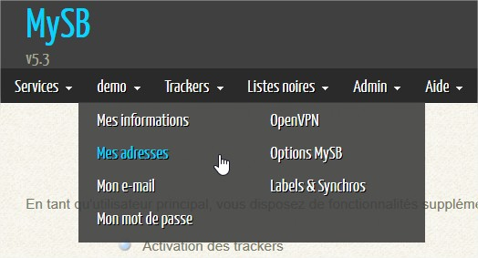
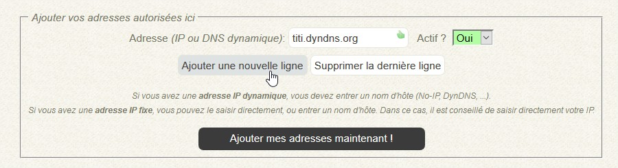
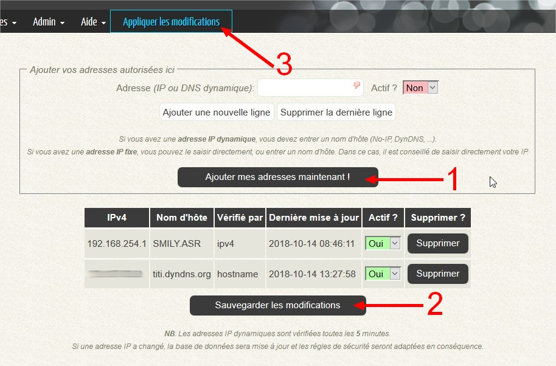

# Ajout de vos adresses

A la fin de l'installation, il est conseillé d'ajouter toutes vos adresses qui seront autorisées à se connecter sur vôtre serveur et à utiliser tous les services tel que le portail.  
Pour cela, connectez-vous à vôtre portail. 

Saisissez l'adresse IP ou le nom d'hôte que vous souhaitez, comme sur l'image ci-dessous.

Puis appliquez vos modifications.

