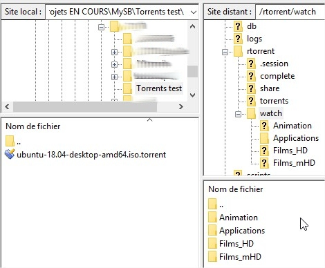
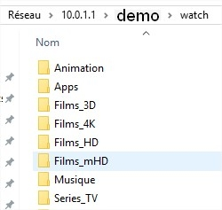
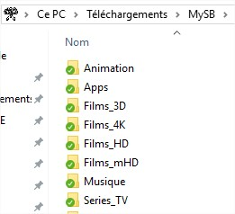

# Dossiers surveillés \(watch\)

Pour ceux qui ne connaissent pas, le dossier **watch** est géré par rTorrent. Ce dossier est surveillé continuellement par rTorrent pour vérifier la présence de nouveaux fichiers .torrent. Chaque fichier .torrent ajouté ici, est alors aspiré par rTorrent pour lancer automatiquement le téléchargement de celui-ci.

Dans MySB, cela va un plus loin grâce aux catégories que l'on ajoute via le portail.

On va reprendre les exemples donnés dans le chapitre [Labels & Synchros](https://mysb.gitbook.io/doc/configuration/labels-and-synchros). Nous avons ajouté 4 catégories:

1. Animation
2. Applications
3. Films HD
4. Films mHD

Chacune de ces catégories sont maintenant présentes dans différents endroit de vôtre serveur, dont le dossier **watch**. Pour pouvoir envoyer vos fichier .torrent dans l'une de ces catégories du dossier **watch**, plusieurs moyen sont possibles:

* FTPs/sFTP
* Samba _\(via OpenVPN\)_
* NextCloud

| FTPs/sFTP | Samba \(via OpenVPN\) | Nextcloud |
| :--- | :--- | :--- |
|  |  |  |
| [Accès FTPs/sFTP](https://mysb.gitbook.io/doc/configuration/ftps-sftp) | [Accès OpenVPN](https://mysb.gitbook.io/doc/configuration/openvpn) | [Accès NextCloud](https://mysb.gitbook.io/doc/configuration/nextcloud) |

