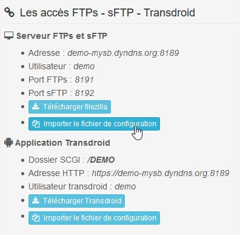
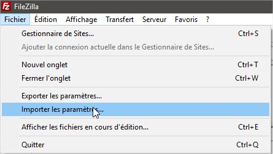
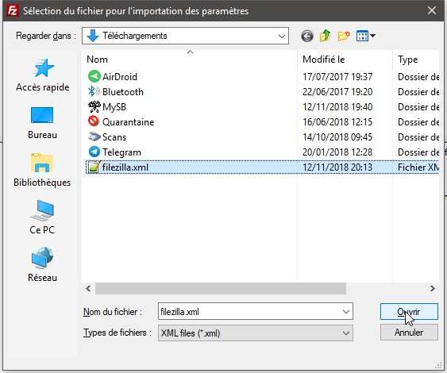
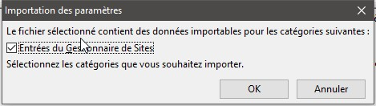
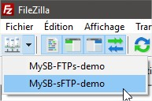

# FTPs / sFTP

## FTPs ou sFTP ?

Le sFTP est un protocole de FTP encapsulé dans un tunnel SSH. _\(Il utilise par défaut le port 22\)_. Le FTPs est aussi un protocole FTP mais sécurisé avec un cryptage SSL/TSL. _\(Le port par défaut est le 990\)_.

Ces méthodes de connexion sont sécurisées toutes les 2, mais chiffrées différemment.

Les débits en téléchargement sont sensiblement les mêmes. La sélection pour l'un ou l'autre reste un choix personnel.

## FileZilla - Configuration

Grâce à **Seedbox-Manager**, vous aurez la possibilité de télécharger le fichier de configuration pour FileZilla.

|  |  |
| :--- | :--- |

|  |  |
| :--- | :--- |

<table>
  <thead>
    <tr>
      <th style="text-align:left">
        
      </th>
      <th style="text-align:left">
        

          
        

        

          
        

      </th>
    </tr>
  </thead>
  <tbody></tbody>
</table>

### Dossier scripts

Si vous décidez d'utiliser les [Labels et Synchros](https://mysb.gitbook.io/doc/configuration/labels-and-synchros), vous aimerez peut-être utiliser vos propres scripts. C'est dans ce dossier que vous les enverrez.

### Dossier rtorrent

Comme vous l'aurez compris, le dossier rtorrent est dédié à l'exploitation de rTorrent.

* /home/user/rtorrent/complete/ Emplacement définitif de vos fichiers terminés;
* /home/user/rtorrent/torrents/ Emplacement de "sauvegarde" de vos fichiers .torrent envoyés dans les dossiers "watch";
* /home/user/rtorrent/watch/ Emplacement surveillé par rTorrent pour "aspirer" vos .torrent et lancer vos téléchargements automatiquement;
* /home/user/rtorrent/share/ Emplacement dédié au partage avec les autres utilisateurs, tout le monde a accès à ce dossier.

Vous pouvez donc envoyer vos fichiers torrent dans le dossier **watch**, puis dans le sous-dossier lié à la catégorie que vous aurez créée.

