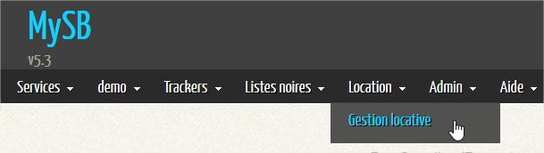
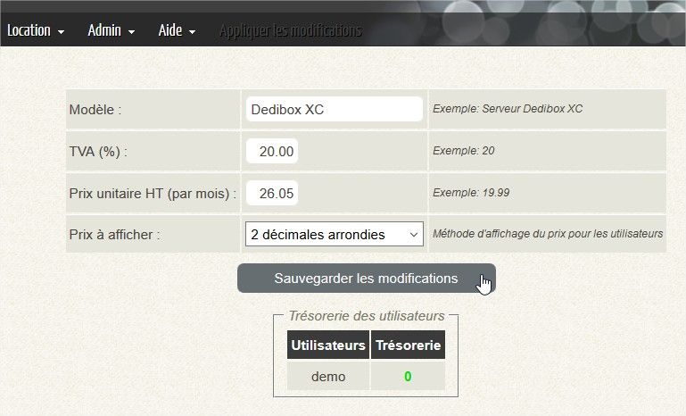
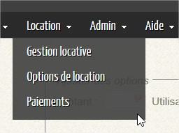
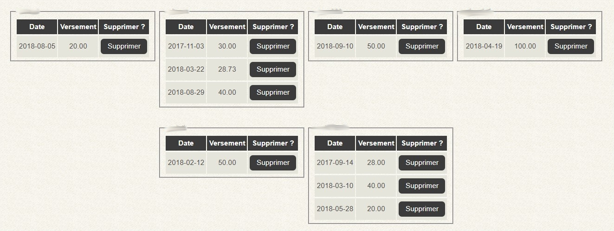
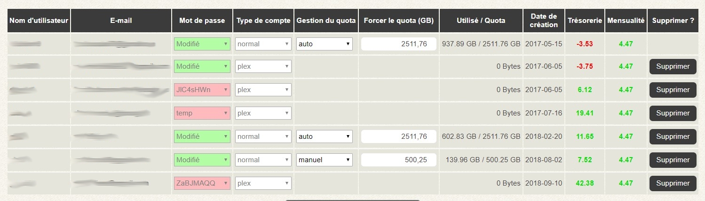

# Gestion locative

## Gestion locative - Partie 1 sur 2

La gestion locative permet d'activer certaines options offrant la possibilité de partager le prix de location de vôtre serveur avec l'ensemble des utilisateurs que vous ajouterez. En gros, si vous payez vôtre serveur 40€/mois et que vous le partagez avec 5 utilisateurs, le prix par utilisateur sera 40/5 soit 8€ par personne.

Pour activer la gestion locative, vous devez vous rendre dans les [Options Systèmes](https://mysb.gitbook.io/doc/configuration/options-systemes#location), et un nouveau menu s'affichera.

Vous devrez renseigner certains champs pour afficher les autres sous-menus. Tant que ces champs ne seront pas renseignés, la location ne sera pas activée.

Renseignez les champs comme dans l'image ci-dessous, en adaptant les valeurs en fonction des vôtres...

### Modèle

Le modèle ou la référence de votre serveur chez votre hébergeur, ou tout autre dénomination pour identifier votre SeedBox. Cela n'aura aucune influence sur la location.

### TVA

Selon votre pays, la TVA peut changer. Appliquer la valeur votre choix. Par exemple, en France c'est 20%.

### Prix unitaire HT

C'est le prix HT _\(Hors Taxes\)_ que vous payez tous les mois pour votre serveur. Vous devrez faire le bon calcul, car souvent vous aurez le prix TTC sur vos factures.

### Prix à afficher

Je recommande **2 décimales arrondies**.

## Gestion locative - Partie 2 sur 2

Une fois que vous aurez renseigné tous les champs, et enregistré les modifications, de nouveaux sous-menus s'afficheront.

1. Options de location
2. Paiements

### Sous-menus

#### Options de location

Vous pourrez ici ajouter des "options" par utilisateurs. Cela peut permettre de modifier le prix par mois pour un utilisateur. Vous pourrez ajouter des options avec des prix négatifs ou positifs, par exemple, des options liées à l'espace de stockage.

#### Paiements

Saisissez ici les différents versements que vos utilisateurs effectueront pour payer leurs mensualités. Les mensualités seront déduites de ces versements et représenteront une trésorerie.

