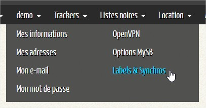
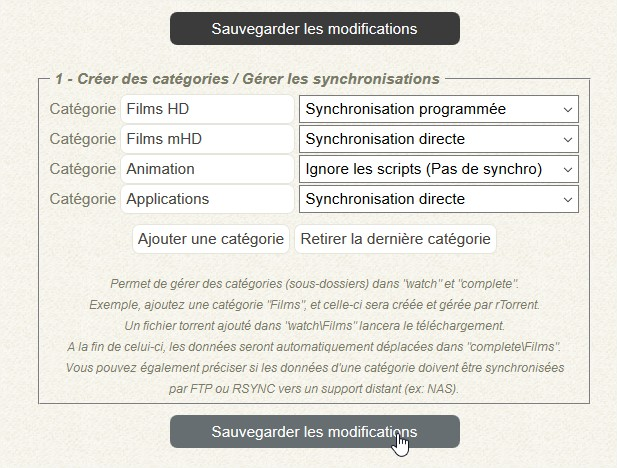
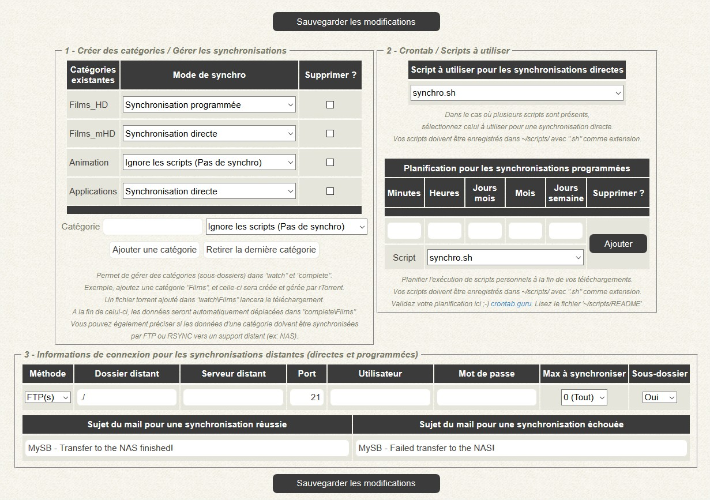
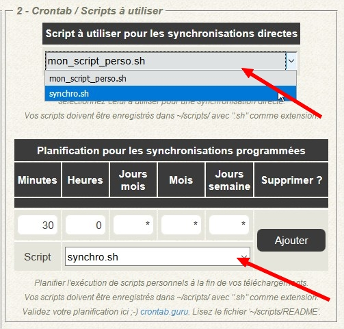
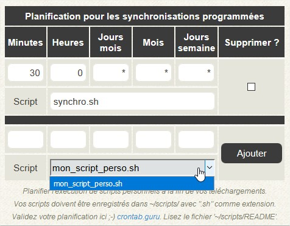
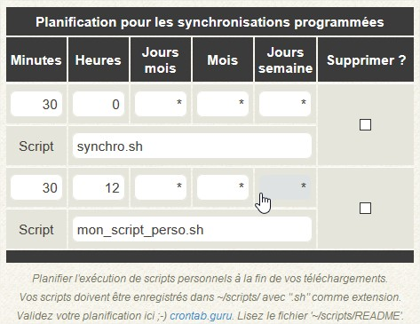
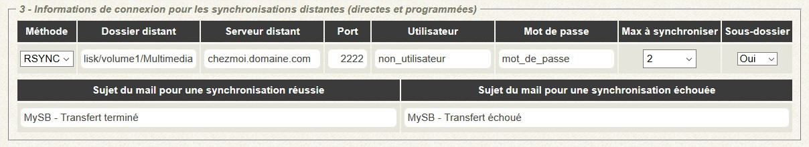
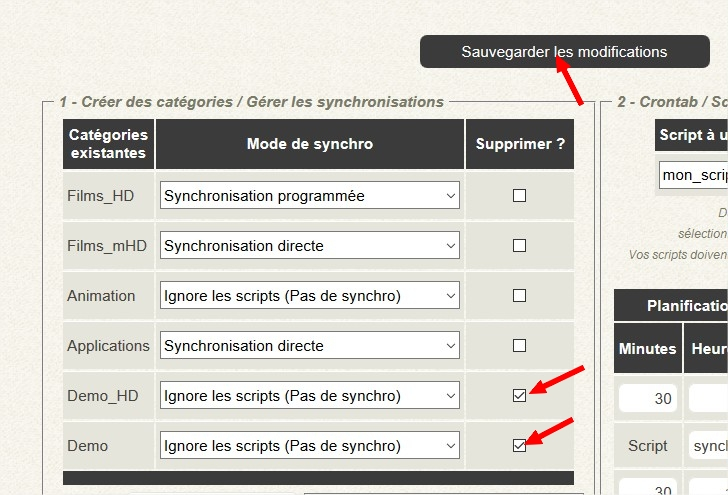

# Labels & Synchros

## Intérêts des labels

Les labels _\(ou catégories\)_ permettent d'organiser vos téléchargements par catégories pour rTorrent et ruTorrent. Des classements par type de fichier ou type de films par exemple. Cela créera des dossiers aux noms de vos labels dans différents endroits de vôtre SeedBox:

| Dossier | Description |
| :--- | :--- |
| /home/user/rtorrent/**complete**/ | Emplacement définitif de vos fichiers terminés |
| /home/user/rtorrent/**torrents**/ | Emplacement de "sauvegarde" de vos fichiers .torrent envoyés dans les dossiers "watch" |
| /home/user/rtorrent/**watch**/ | Emplacement surveillé par rTorrent pour "aspirer" vos .torrent et lancer vos téléchargements automatiquement |

Un dossier sera également créé si vous utilisez la synchronisation de vos fichiers vers l'emplacement distant.

Tous les utilisateurs disposant d'un compte **normal** peut gérer des labels.

Le fonctionnement est simple. En prenant en exemple une catégorie nommée **Films\_HD**, on obtiendra l'arborescence suivante:

* /home/user/rtorrent/**complete**/**Films\_HD**/
* /home/user/rtorrent/**torrents**/**Films\_HD**/
* /home/user/rtorrent/**watch**/**Films\_HD**/

1. On envoie un fichier .torrent dans le dossier /home/user/rtorrent/**watch/Films\_HD**/;
2. Le téléchargement se lance, et le fichier téléchargé se retrouve dans /home/user/rtorrent/**complete/Films\_HD**/;
3. Le fichier .torrent envoyé dans /home/user/rtorrent/watch/Films\_HD/ et ensuite déplacé dans /home/user/rtorrent/**torrents/Films\_HD**/.

Si jamais un mode de synchronisation est affecté à cette catégorie, alors le fichier téléchargé sera envoyé vers la destination de vôtre choix. Soit immédiatement une fois le fichier téléchargé, soit de manière programmée à une heure que vous aurez déterminée.

Il est possible de choisir le type de synchronisation à affecter à une catégorie.

* Ignore les scripts _\(Pas de synchro\)_
* Synchronisation programmée
* Synchronisation directe

Un autre intérêt de ces catégories est l'organisation de vos bibliothèques dans Plex si jamais vous décidez de l'utiliser. En gros, une catégorie créée ici correspondra à une bibliothèque dans Plex.

## Gestion des téléchargements terminés

Rendez-vous dans vôtre menu utilisateur.

Vous pouvez ajouter jusqu'à 5 catégories à la fois en cliquant sur **Ajouter une catégorie**. Donnez un nom à toutes vos catégories et sélectionnez un type de synchronisation à chacune d'elles. Pour le nommage, les accents et les espaces sont autorisés lors de la saisie. Mais au final, l'accentuation sera supprimée et les espace remplacés par des des **tirais bas** _\(\_\)_.

Une fois vos catégories ajoutées, cliquez sur **Sauvegarder les modifications**.

Si vous avez sélectionné **Synchronisation programmée** ou **Synchronisation directe** pour l'une ou plusieurs de vos catégories, de nouvelles options s'afficheront.

1. Crontab / Scripts à utiliser
2. Informations de connexion pour les synchronisations distantes _\(directes et programmées\)_

### Crontab / Scripts à utiliser

Ici, on sélectionne les scripts à utiliser pour vos synchronisations. Un script différent peut être utiliser pour les synchronisations programmées et directes. Un script est déjà proposé remplissant déjà les besoins principaux. Toutefois, vous avez la possibilité d'ajouter tous les scripts que vous désirez dans le dossier **/home/user/scripts/** 🙂

Le script par défaut est **synchro.sh**. Pour l'exemple, j'ai ajouté le script **mon\_script\_perso.sh**.

Dans l'exemple, les synchronisations programmées seront lancées tous les jours à **0h30** et utiliseront le script **synchro.sh**. Une fois la planification et le script choisit, cliquez sur **Ajouter**.

Pour les synchronisations programmées, il est possible d'affecter autant de programmation qu'il y aura de script.

Comme nous avons ajouté un second script, nous avons pu ajouter une première programmation. Et nous pouvons en ajouter une seconde, en utilisant le second script.

| Planification 1 _\(synchro.sh\)_ | Planification 2 _\(mon\_script\_perso.sh\)_ |
| :--- | :--- |

|  |  |
| :--- | :--- |


_**NOTE**: Veillez à ne pas supprimer ou renommer le script par défaut **synchro.sh**. Celui-ci sera restauré à chaque redémarrage de rTorrent._


### Synchronisations distantes

Que ce soit pour les synchronisations directes ou programmées, il est est nécessaire de préciser où seront envoyés vos fichiers. Sinon, ben ça marche pas 😋

Dans l'idée, il est devient possible d'envoyer vos fichiers vers un vôtre NAS par exemple. Il vous incombe de gérer vous même les ouvertures de ports sur vôtre routeur/firewall.

Ces champs sont actuellement utilisés par le script **synchro.sh**. C'est lui qui enverra les mails de fin de synchronisation.

#### Méthode

Choix possibles, **RSYNC** ou **FTP/FTPs**, il s'agit de la méthode de transfert.

#### Dossier distant

Le dossier distant où seront envoyés vos fichiers, la racine.

#### Serveur distant

Ben, l'adresse...

#### Port

Le port pour la méthode utilisée.

#### Utilisateur

Le nom d'utilisateur pour la connexion.

#### Mot de passe

Le mot de passe pour la connexion.

#### Max à synchroniser

Il est possible de choisir la quantité de fichiers à envoyer. Si vous sélectionnez 2 par exemple, alors que vous avez 10 fichiers en attente, alors vos téléchargements seront envoyés 2 par 2, soit 2 par jour.

#### Sous-dossier

Permet de créer un dossier au nom de vôtre fichier. Il arrive que certains téléchargements soit un fichier unique. Parfois, certains téléchargement contiennent plusieurs fichiers contenus dans un dossier parent. En activant cette option, si vôtre téléchargement est un fichier unique, alors un dossier parent sera créé dans la destination, et le fichier unique sera stocké dedans. Certains lecteurs multimédia fonctionnent ainsi pour pouvoir détecter un film.

#### Sujet du mail pour une synchronisation réussie

A chaque synchronisation réussie, vous recevrez un mail récapitulatif correspondant au transfert. Vous pouvez choisir ici le sujet du mail.

#### Sujet du mail pour une synchronisation échouée

Même chose, à chaque synchronisation échouée, un mail vous sera envoyé. Vous pouvez choisir ici le sujet du mail.

### Finalisation

Maintenant que tous les champs sont renseignés, vous pouvez cliquer sur **Sauvegarder les modifications**, puis sur **Appliquer les modifications**. A partir de là, toutes vos catégories seront créées là où il faut et vous serez prêt à utiliser vôtre SeedBox.

## Suppression d'une catégorie

Pour supprimer une catégorie, c'est facile.

Cochez les catégories à supprimer, cliquez sur **Sauvegarder les modifications**, puis sur **Appliquer les modifications**. Tous les dossiers correspondant à la catégorie à supprimer seront effacés.


_**NOTE**: Seule une catégorie vide pourra être supprimée. C'est à dire qu'il ne doit plus y avoir de fichiers présents dans /home/user/rtorrent/**complete/Categorie**/. Une fois la suppression lancée, celle-ci sera effective uniquement lorsque le dossier ci-dessus sera vide._


## Exemple de mail d'un transfert réussi

On peut d'ailleurs constater le résultat de l'option **Sous-dossier** grâce aux lignes **From** et **To**. Le fichier téléchargé et présent sur le serveur _\(**From**\)_, est un fichier unique, directement stocké à la racine de la catégorie **Films\_HD**. Grâce à l'option **Sous-dossier**, le script **synchro.sh** crée un dossier du même nom dans la destination _\(**To**\)_.

[Visualiser l'exemple](https://mysb.gitbook.io/doc/les-mails/transfert-termine)

