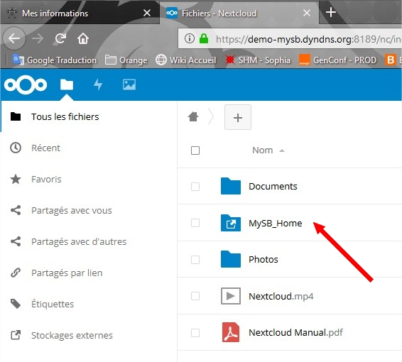
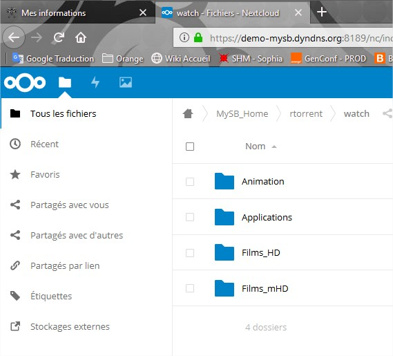
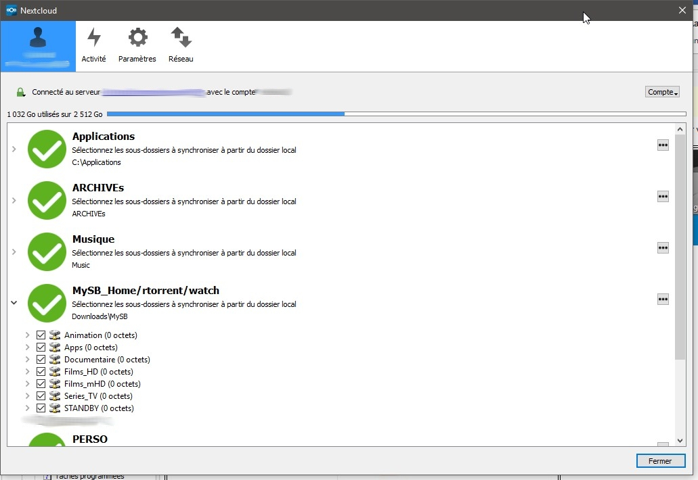

# NextCloud

## Présentation

[Télécharger le client NextCloud](https://nextcloud.com/install/#install-clients)

NextCloud vous permettra de stocker, partager, synchroniser vos fichiers comme il sait le faire.  
J'y ai seulement ajouté l'accès à vôtre **/home** 😇   
Ce qui veut dire, en toute logique, que si vous installez le client GUI, vous aurez accès au dossier **watch**, et donc de pouvoir enregistrer vos torrents directement sur vôtre poste client.

<table>
  <thead>
    <tr>
      <th style="text-align:left"></th>
      <th style="text-align:left"></th>
    </tr>
  </thead>
  <tbody>
    <tr>
      <td style="text-align:left">
        

        

          
        

      </td>
      <td style="text-align:left">
        

        

          
        

      </td>
    </tr>
  </tbody>
</table>

Par exemple, vous pouvez créer un un dossier **MySB** dans Téléchargements sur vôtre PC, et synchroniser à l'intérieur le contenu du dossier **watch**.

## Compte administrateur

Il est possible de se connecter en tant qu'administrateur à l'interface d'administration de NextCloud.  
Cela peut être utile pour gérer les applications additionnelles.

Vous devez récupérer le mot de passe MySB généré lors de l'installation.  
Pour cela, suivez les étapes:

1. connectez-vous en SSH en tant que ROOT
2. tapez cette commande: `cat /etc/MySB/config_db`
3. copier la valeur de la variable **MySQL\_MysbPassword**
4. ouvrez vôtre navigateur avec une session privée _\(ou déconnectez-vous de toute session active\)_
5. tapez l'URL **https://monserveur.mondomaine.com:8189/nc/**
6. identifiez-vous avec le compte admin et le mot de passe récupéré


_**Ne modifiez pas les options de paramétrage de NextCloud. Cela pourrait poser problème lors des mises à jour de MySB.**_


