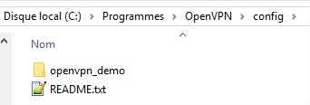

# OpenVPN

## Les types de connexion

3 types de connexion sont disponibles.

1. **Mode routé** _**\(TUN 1\)**_ En plus d'un accès local à vôtre SeedBox, vous pouvez surfer sur Internet en utilisant l'adresse IP de celle-ci. La plage IP dédiée pour ce mode est 10.0.**0**.0/24, où 10.0.**0.1** correspond au serveur. Le port dédié pour ce mode est le **8193** en TCP ou UDP, ou tout autre port que vous aurez choisi lors de l'installation. 
2. **Mode routé** _**\(TUN 2\)**_ Ici, vous disposez seulement d'un accès local à vôtre SeedBox. La plage IP dédiée pour ce mode est 10.0.**1**.0/24, où 10.0.**1.1** correspond au serveur. Le port dédié pour ce mode est le **8194** en TCP ou UDP, ou tout autre port que vous aurez choisi lors de l'installation. 
3. **Mode bridgé** _**\(TAP\)**_ Avec le mode bridgé, vous disposez également d'un accès local à vôtre SeedBox. Ce mode permet de laisser passer certains flux comme le Broadcast, utile pour certains cas d'utilisation. La plage IP dédiée pour ce mode est 10.0.**2**.0/24, où 10.0.**2.1** correspond au serveur. Le port dédié pour ce mode est le **8195** en TCP ou UDP, ou tout autre port que vous aurez choisi lors de l'installation.


_**Note**: Le mode bridgé \(TAP\) n'est pas terminé. A moins de savoir ce que vous faites, merci de ne pas l'utiliser._

_**Note**: Le protocol \(TCP/UDP\) peut être modifié via le portail après l'installation via le menu **Admin** &gt; **Options système**._


En vous connectant avec OpenVPN, vous aurez la possibilité d'exploiter les partages Samba et NFS.

A savoir que le partage NFS est en lecture seule, contrairement à Samba qui est en lecture/écriture.  
Dans les 2 cas, vous aurez accès à vôtre **/home**.

## Fichiers de configuration

Les fichiers de configuration sont téléchargeables via un **fichier ZIP** pour chacun des utilisateurs disposant d'un compte normal _\(rTorrent\)_, via le menu **Utilisateur** &gt; **OpenVPN**.

Chaque fois que vous souhaiterez télécharger vos fichiers de configuration, vous devrez les régénérer à chaque fois, prévu dans le cas où vous décidez de modifier le protocole de connexion _\(TCP ou UDP\)_.  
Une fois la demande de génération demandée, il vous sera proposé de **télécharger** un fichier ZIP.

<table>
  <thead>
    <tr>
      <th style="text-align:left"></th>
      <th style="text-align:left"></th>
    </tr>
  </thead>
  <tbody>
    <tr>
      <td style="text-align:left">
        

        

          
        

      </td>
      <td style="text-align:left">
        

        

          
        

      </td>
    </tr>
  </tbody>
</table>Le fichier ZIP est protégé par un mot de passe, celui de l'utilisateur.  
Ce ZIP contient certains fichiers, les différents fichiers de configuration et les clés pour OpenVPN.

J'ai pris soins de fournir des fichiers de configuration "fichier unique" _\(**Single**\)_, contenant la configuration ainsi que les clés de chiffrement.  
Et d'autres fichiers ne contenant que la configuration OpenVPN, et de fournir les clés séparément.  
Selon les cas, cela peut être utile.

### Exemples de connexion

#### OpenVPN GUI pour Windows

[Télécharger le client OpenVPN](https://openvpn.net/community-downloads/)

<table>
  <thead>
    <tr>
      <th style="text-align:left"></th>
      <th style="text-align:left"></th>
    </tr>
  </thead>
  <tbody>
    <tr>
      <td style="text-align:left">
        

        

          
        

      </td>
      <td style="text-align:left">
        

        

          
        

      </td>
    </tr>
  </tbody>
</table>#### Routeur avec firmware Tomato

* [Tomato USB](http://tomatousb.org/)
* [Tomato by Shibby](http://tomato.groov.pl/), basé sur Tomato USB
* [Advenced Tomato](https://advancedtomato.com/), basé sur Tomato by Shibby. La même chose que l'original, mais relooké.

<table>
  <thead>
    <tr>
      <th style="text-align:left"></th>
      <th style="text-align:left"></th>
    </tr>
  </thead>
  <tbody>
    <tr>
      <td style="text-align:left">
        

        

          
        

      </td>
      <td style="text-align:left">
        

        

          
        

      </td>
    </tr>
  </tbody>
</table>## NFS & Samba

Selon la connexion OpenVPN utilisée, l'adresse IP sera différente pour accéder à NFS ou Samba.

* 10.0.0.1
* 10.0.1.1
* 10.0.2.1

### Partage Samba

Une fois connecté avec OpenVPN, vous aurez accès à vôtre partage Samba, et ainsi monter un lecteur réseau.

<table>
  <thead>
    <tr>
      <th style="text-align:left"></th>
      <th style="text-align:left"></th>
    </tr>
  </thead>
  <tbody>
    <tr>
      <td style="text-align:left">
        

        

          
        

      </td>
      <td style="text-align:left">
        

        

          
        

        

        

          
        

      </td>
    </tr>
  </tbody>
</table>### Partage NFS

NFS sera plus orienté Linux, Mac ou même Kodi.

#### NFS v3

`mount -t nfs 10.0.x.1:/home/demo /destination -o nolock`

#### NFS v4

mount -t nfs4 10.0.x.1:/export/demo /destination -o nolock 

