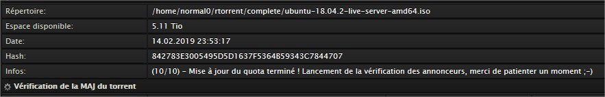
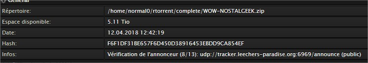

# Options systèmes

Allez dans les options systèmes via le menu **Admin** &gt; **Options système**.

Vous devrez vous identifier pour accéder à toute page réservée au compte principal. Les identifiants sont ceux du compte principal.

Activez/désactivez les options que vous souhaitez.

## PeerGuardian

### Statistiques

Active ou non la réception des rapports e-mails des tentatives de connexions à vôtre serveur. Ces rapports sont instructifs.

### Watchdog

Active ou non la réception des e-mails du watchdog de PeerGuardian, à savoir, si PeerGuardian est arrêté alors qu'il ne devrait pas l'être. Vous devriez laisser cette option active.

## IPtables

Active ou non la restriction par adresse IP à vôtre serveur. Si désactivée, alors les adresses ajoutées manuellement ne seront pas prises en compte et tout le monde aura la possibilité de se connecter à vôtre serveur.

## Location

Active ou non le système de location de vôtre SeedBox. En activant cette option, un nouveau menu **Location** s'affichera. Activez-la si vous souhaitez partager le prix de location de vôtre SeedBox avec les utilisateurs que vous ajouterez. Il sera alors nécessaire de [configurer ](https://mysb.gitbook.io/doc/configuration/gestion-locative)cette partie pour que la location soit prise en compte.

## Recyclage des téléchargements

L'idée de cette option est d'éviter de télécharger à nouveau le contenu d'un torrent qui a déjà été téléchargé par un autre utilisateur. Cela permet de copier simplement le contenu du torrent à partir de l'espace d'un autre utilisateur.

| Choix | Description |
| :--- | :--- |

| **Non** | Fonctionnement normal, aucune copie, le torrent sera téléchargé complètement. |
| :--- | :--- |

| **Copie simple** | Si le contenu du torrent existe déjà quelque part, il sera copié au-lieu d'être téléchargé à nouveau. _\(cp -a\)_ |
| :--- | :--- |

<table>
  <thead>
    <tr>
      <th style="text-align:left"><b>Lien dur</b>
      </th>
      <th style="text-align:left">
        
Identique &#xE0; la copie simple, &#xE0; la diff&#xE9;rence qu&apos;un
          lien dur est effectu&#xE9; &#xE0; la place. Les utilisateurs ayant le m&#xEA;me
          torrent partageront les m&#xEA;mes inodes sur le disque. <em>(cp -al)</em>
        

        
La m&#xE9;thode <b>Lien dur</b> affecte la gestion des quotas pour les utilisateurs
          concern&#xE9;s.

      </th>
    </tr>
  </thead>
  <tbody></tbody>
</table>
En activant le recyclage **lien dur**, la gestion des quotas sera affectée pour les utilisateurs concernés ! Le **premier** utilisateur ayant téléchargé un contenu verra forcément son quota affecté par l'espace utilisé par ce contenu. Le **second** utilisateur téléchargeant le même contenu verra son quota affecté par l'espace utilisé par ce contenu, mais **libérera** celui du premier utilisateur.


## Trackers autorisés

Cette option permet d'effectuer un filtre sur les torrents qui seront uploadés par tous les utilisateurs. Avec cette option, il n'est plus utile d'ajouter manuellement un tracker dans le portail pour pouvoir le bloquer. C'est maintenant automatique dès l'ajout de n'importe quel torrent.

Les actions effectuées permettent de lister tous les annonceurs contenus dans un torrent et de les filtrer/désactiver à la volée avant le début du téléchargement. Par défaut, tous les annonceurs en IPv6 sont désactivés.

### Type

| Choix | Description |
| :--- | :--- |
| **Privés & Publiques** | Autorisera tous les torrents provenant de trackers privés, semi-privés ou publiques. |
| **Privés seulement** | Autorisera uniquement les torrents provenant de trackers privés et semi-privés, et bloquera les autres. |


_En cas d'activation de **Privés seulement**, tous les .torrents publiques qui seront ajoutés seront automatiquement retirés de la session de l'utilisateur concerné. Un mail lui sera envoyé._


### Auto blocks annonceurs

Ce paramètre ajoute une surcouche au processus de filtrage des annonceurs en utilisant les listes de blocage actives sur le système.

Je prends l'exemple de YGG. Certains torrents provenant de ce tracker dispose d'un seul annonceur ayant une adresse appartenant à YGG. Tandis que d'autres torrents sont constitués d'une multitudes d'annonceurs provenant de n'importe où dans le monde. Je trouve cela gênant, surtout si l'un de ces annonceurs devrait être bloqué par PeerGuardian.

Ce paramètre permet donc de désactiver automatiquement tous les annonceurs officieux dont l'adresse IP ferait partie d'une liste de blocage.

## Torrents

### Filtrage des torrents

Active ou non le filtrage de tous les annonceurs présents dans un .torrent ajouté par n'importe quel utilisateur.

Le filtrage consiste à vérifier chaque annonceur en effectuant divers vérifications telles que:

* un nslookup pour récupérer toutes les adresses IP liées à l'annonceur
* vérification de toutes les adresses IP trouvées en faisant un ping et une vérification d'une éventuelle présence dans une liste de blocage. Les IP appartenant à une liste peuvent être bloquées automatiquement \(cf. chapitre [Auto blocks annonceurs](options-systemes.md#auto-blocks-annonceurs)\).
* une tentative de récupération d'un éventuel certificat SSL


_Il est conseillé de laisser cette fonction activée. La mécanique a été pensée pour tourner en tâche de fond, ne bloquant pas l'ajout de nouveaux .torrent._



_Lors d'ajout d'un .torrent, si les annonceurs présents à l'intérieur **n'ont pas encore été ajoutés** à MySB, il peut se passer **quelques bonnes secondes** avant que le téléchargement **se lance**. C'est normal, surtout si **beaucoup d'annonceurs** sont détectés..._



Pour chaque .torrent ajouté, il est possible de suivre l'avancement du traitement en double cliquant dessus dans la liste de ruTorrent _\(Onglet **Général**, ligne **Infos**\)_.


### Gestion de l'UDP

Active ou non la prise en charge des annonceurs en UDP _\(Defaut: **Non**\)_.

En autorisant les annonceurs en UDP, vous augmentez le nombre de sources disponibles. Mais cela peut aussi présenter un risque potentiel quant à vôtre anonymat, le protocole UDP étant mois fiable que le TCP _\(HTTP\)_.

## OpenVPN

Permet de modifier le protocole à utiliser pour OpenVPN, **UDP** ou **TCP**. Si vous modifiez le protocole, vous devrez régénérer tous les fichiers de configuration pour tous les utilisateurs.

## DNScrypt-proxy

Active ou non l'utilisation de DNScrypt-proxy. Si l'option est désactivée, des DNS publiques seront utilisés à la place de DNScrypt. Les DNS de remplacements sont ceux de:

**Quad 9**

* 9.9.9.9
* 149.112.112.112

**OpenDNS**

* 208.67.222.222
* 208.67.220.220

**Level 3**

* 4.2.2.1
* 4.2.2.2
* 4.2.2.3
* 4.2.2.4
* 4.2.2.5
* 4.2.2.6

## LogWatch

Active ou nom la réception des rapports e-mails provenant de LogWatch.

