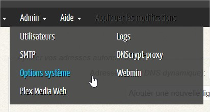
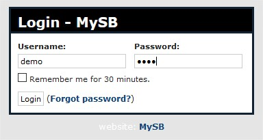
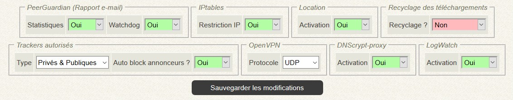

# Options systèmes

Allez dans les options systèmes via le menu **Admin** &gt; **Options sytème**.

Vous devrez vous identifier pour accéder à toute page réservée au compte principal.  
Les identifiants sont ceux du compte principal.

Activez/désactivez les options que vous souhaitez.

## PeerGuardian

### Statistiques

Active ou non la réception des rapports e-mails des tentatives de connexions à vôtre serveur.  
Ces rapports sont instructifs.

### Watchdog

Active ou non la réception des e-mails du watchdog de PeerGuardian, à savoir, si PeerGuardian est arrêté alors qu'il ne devrait pas l'être.  
Vous devriez laisser cette option active.

### IPtables

Active ou non la restriction par adresse IP à vôtre serveur.  
Si désactivée, alors les adresses ajoutées manuellement ne seront pas prises en compte et tout le monde aura la possibilité de se connecter à vôtre serveur.

## Location

Active ou non le système de location de vôtre SeedBox.  
En activant cette option, un nouveau menu **Location** s'affichera.  
Activez-la si vous souhaitez partager le prix de location de vôtre SeedBox avec les utilisateurs que vous ajouterez. Il sera alors nécessaire de [configurer ](https://mysb.gitbook.io/doc/v/v5.3_fr/configuration/gestion-locative)cette partie pour que la location soit prise en compte.

## OpenVPN

Permet de modifier le protocole à utiliser pour OpenVPN, **UDP** ou **TCP**.  
Si vous modifiez le protocole, vous devrez régénérer tous les fichiers de configuration pour tous les utilisateurs.

## DNScrypt-proxy

Active ou non l'utilisation de DNScrypt-proxy.  
Si l'option est désactivée, des DNS publiques seront utilisés à la place de DNScrypt.  
Les DNS de remplacements sont ceux de:

**Google**

* 8.8.8.8
* 8.8.4.4

**OpenDNS**

* 208.67.222.222
* 208.67.220.220

**Level 3**

* 4.2.2.1
* 4.2.2.2
* 4.2.2.3
* 4.2.2.4
* 4.2.2.5
* 4.2.2.6

## LogWatch

Active ou nom la réception des rapports e-mails provenant de LogWatch.

