# Plex Media Server & Tautulli

## Plex - Ajout de vôtre SeedBox

Ah, Plex, un grand sujet de discussion...  
J'ai eu beaucoup de demandes d'aide à ce sujet. Toutes avaient le même sujet, _"ça marche pas, je ne trouve pas mon serveur"_...

Je vous propose donc 2 solutions, une très simple et une un peu moins.

Pour une première tentative de configuration, on commencera par la plus simple.


_**NOTE**: Vous devrez préalablement vous créer un compte sur_ [_Plex.tv_](https://www.plex.tv/) _en cliquant sur **Sign Up**, en haut à droite._


### Via le portail MySB

Le lien via le portail ne fonctionnera **que** si vous **n'**avez **pas** de session Plex **active** dans votre navigateur.

Le meilleur moyen consiste à ouvrir le lien directement en **mode privé** dans votre navigateur, comme dans la capture d'écran, en faisant un clic droit sur le lien.

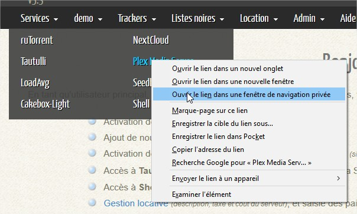

Vous devrez vous reconnecter à MySB avec vos informations d'identification avant d'être redirigé vers la page de configuration Plex. Dans l'exemple, j'utilise le navigateur Firefox.

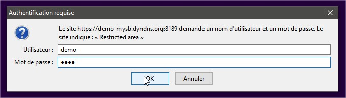

A ce stade, vous devez vous connecter à vôtre compte Plex.

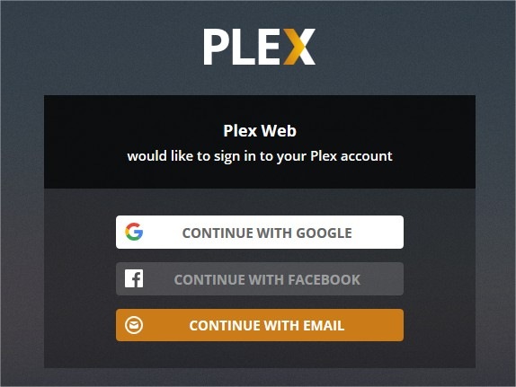

### Via un tunnel SSH _\(Putty / Kitty\)_

Lancez Putty ou Kitty et suivez ceci:

#### Menu Session

1. Entrez l'adresse de votre serveur _\(nom d'hôte ou IP\)_
2. Renseignez le port SSH que vous avez choisi lors de l'installation

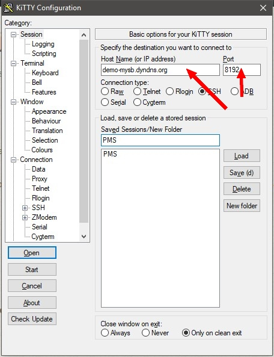

#### Menu Connection &gt;SSH &gt; Tunnels

1. Dans **Source port**, saisissez **8888**;
2. Dans **Destination**, saisissez l'**adresse** de vôtre SeedBox et le **port** utilisé par Plex en respectant cette syntaxe: _demo-mysb.dyndns.org:**32400**_
3. Cliquez sur **Add**;
4. Cliquez sur **Open** pour démarrer le tunnel SSH;
5. Authentifiez-vous sur vôtre SeedBox avec le compte ROOT, et laissez la fenêtre SSH ouverte.

<table>
  <thead>
    <tr>
      <th style="text-align:left"></th>
      <th style="text-align:left"></th>
    </tr>
  </thead>
  <tbody>
    <tr>
      <td style="text-align:left">
        

        

          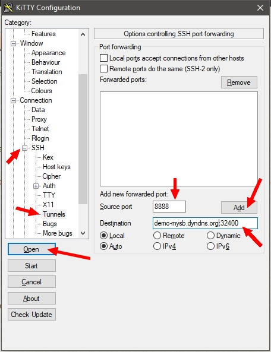
        

      </td>
      <td style="text-align:left">
        

        

          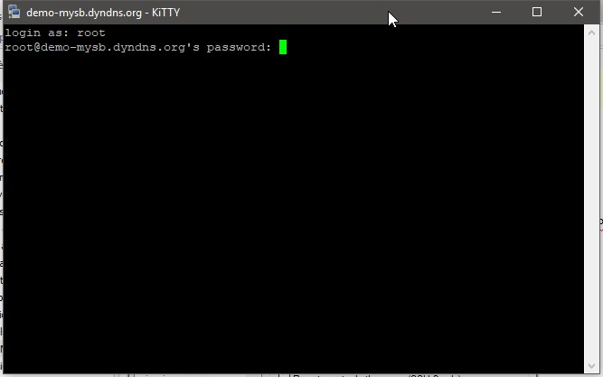
        

      </td>
    </tr>
  </tbody>
</table>Maintenant, lancez votre navigateur avec une **session privée** et tapez l’adresse [http://127.0.0.1:8888/web](http://127.0.0.1:8888/web).

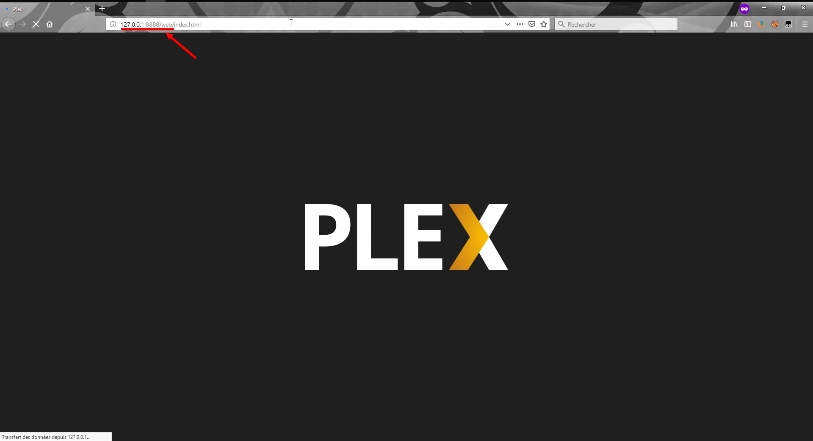

A ce stade, vous devez vous connecter à vôtre compte Plex.

## Plex - Premiers pas

Si vous voyez une page de ce genre, alors c'est très bon signe 😛   
Cliquez sur **J'ai compris !**

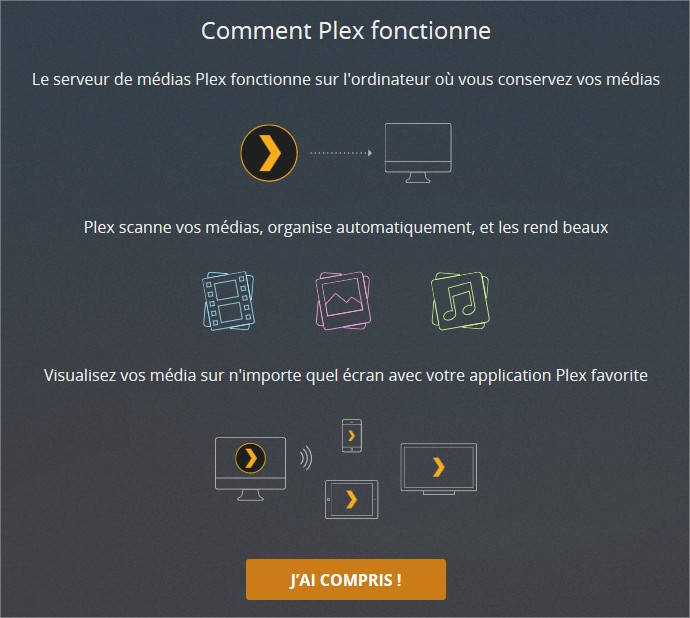

Si tout va bien, vous devriez avoir cette page indiquant qu'un serveur a été trouvé, avec son nom d'affiché _\(celui de vôtre SeedBox\)_.  
Laissez la case cochée **M'autoriser à accéder à mes médias en dehors de ma maison**.  
Puis cliquez sur **Suivant**.

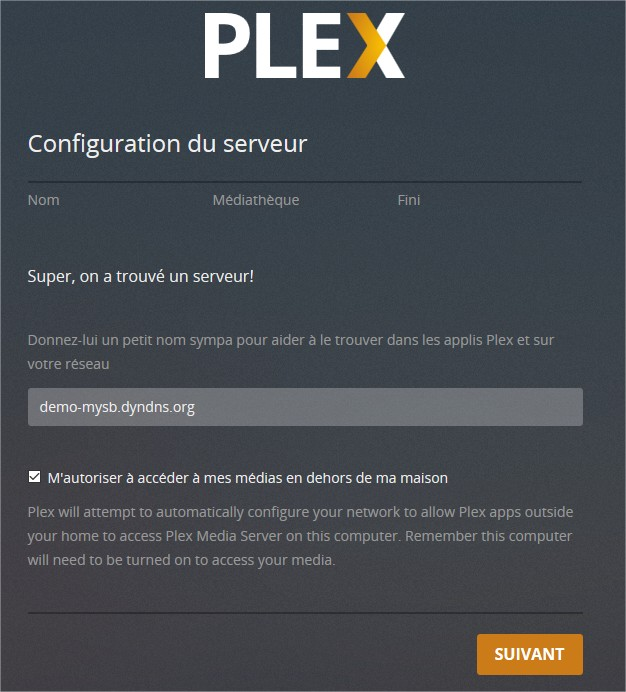

Maintenant, il vous est proposé d'ajouter des bibliothèques.  
Mais en verra cela plus loin, cliquez sur **Suivant**. Et dans la page suivante, cliquez sur **Terminé**.

<table>
  <thead>
    <tr>
      <th style="text-align:left"></th>
      <th style="text-align:left"></th>
    </tr>
  </thead>
  <tbody>
    <tr>
      <td style="text-align:left">
        

        

          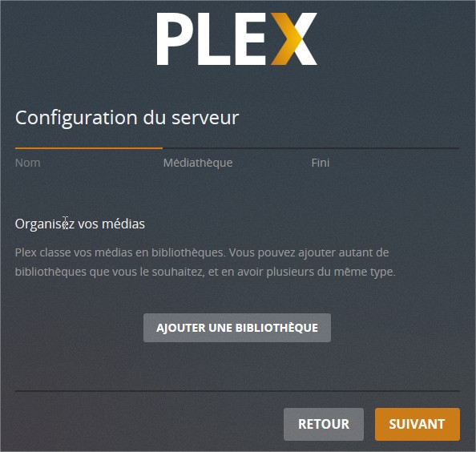
        

      </td>
      <td style="text-align:left">
        

        

          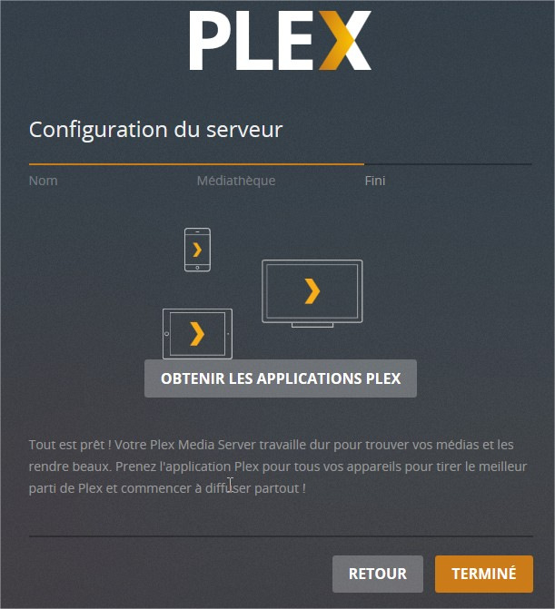
        

      </td>
    </tr>
  </tbody>
</table>Surprise !!!  
Vôtre SeedBox a été ajoutée à vôtre compte Plex !!!!  
Pouwwwaa, de la bombe ! 🤪   
Il ne reste plus qu'à ajouter vos bibliothèques.

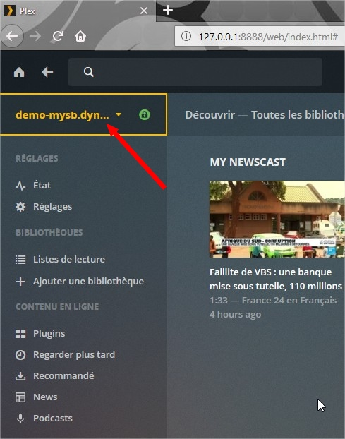

En gros, les catégories que vous avez créées dans le portail MySB peuvent correspondre aux bibliothèques dans Plex.

## Plex - Ajouter des bibliothèques

Dans cet exemple, je vais restez dans la même logique que lors de l'ajout de nos catégories dans le portail MySB, a savoir:

* Films HD
* Films mHD
* Animation

Cliquez sur **Ajouter une bibliothèque** dans la colonne de gauche.  
Sélectionnez le **type** de la bibliothèque, **Films** pour notre exemple.  
Renommez la bibliothèque en **Films HD** et sélectionnez la **langue générale** de vos films.

Ensuite, cliquez sur **Ajouter des dossiers**, puis sur **Naviguer vers un dossier multimédia**. Cela affichera une fenêtre pour vous permettre de naviguer à l'intérieur de vôtre SeedBox.

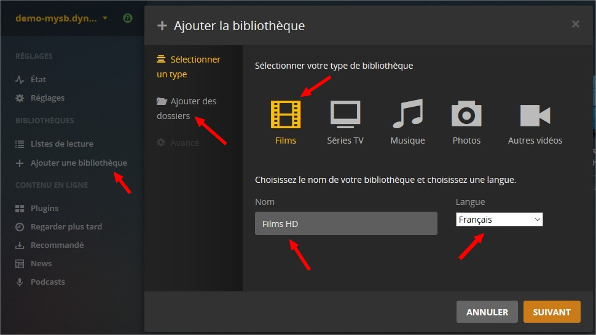

Naviguez jusque dans le dossier /home/user/**rtorrent/complete**/.  
D'abord en cliquant sur **/** à gauche, puis sur **home** à droite.

<table>
  <thead>
    <tr>
      <th style="text-align:left"></th>
      <th style="text-align:left"></th>
    </tr>
  </thead>
  <tbody>
    <tr>
      <td style="text-align:left">
        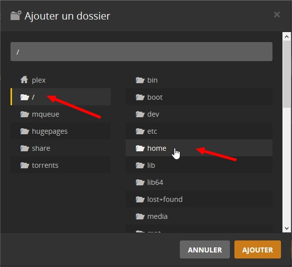
      </td>
      <td style="text-align:left">
        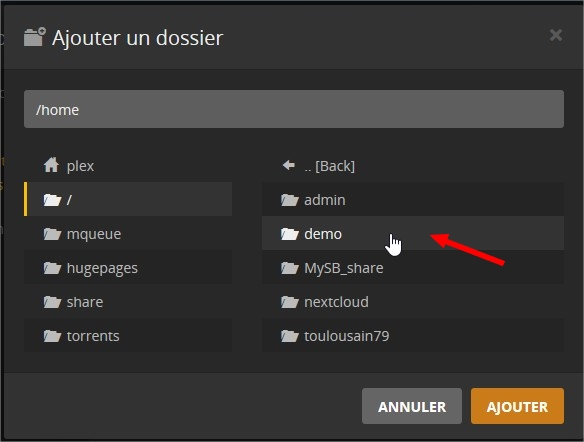
      </td>
    </tr>
    <tr>
      <td style="text-align:left">
        

          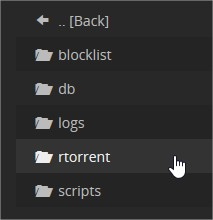
        

        

      </td>
      <td style="text-align:left">
        

          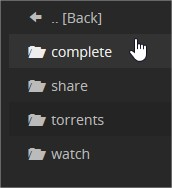
        

        

      </td>
    </tr>
  </tbody>
</table><table>
  <thead>
    <tr>
      <th style="text-align:left"></th>
      <th style="text-align:left"></th>
    </tr>
  </thead>
  <tbody>
    <tr>
      <td style="text-align:left">
        

        

          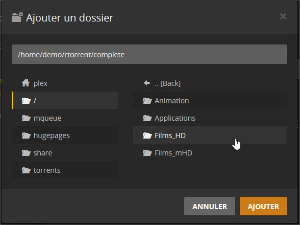
        

      </td>
      <td style="text-align:left">
        
Et l&#xE0;, miracle, on retrouve nos cat&#xE9;gories ajout&#xE9;es plus
          t&#xF4;t dans le portail.

        

        
Cliquez sur <b>Films_HD</b> pour continuer l&apos;exemple, puis sur <b>Ajouter</b>.

      </td>
    </tr>
  </tbody>
</table>Puis enfin, cliquez sur **Ajouter une bibliothèque**.

Voilà, notre première bibliothèque Plex est maintenant disponible !

Ceci est une manière de faire, une catégorie pour une bibliothèque. Mais il est tout à fait possible d'ajouter plusieurs dossiers dans une même bibliothèque.

Par exemple, nous aurions pu ajouter les catégories **Films\_HD** et **Films\_mHD** dans une seule bibliothèque nommée **Films**, tout simplement.

Maintenant, chaque fois que vous ajouterez un fichier dans Films\_HD, il apparaîtra automatiquement dans Plex.

## Configurer Tautulli

[Tautulli ](https://tautulli.com/)est bel outil plutôt pratique, permettant d'obtenir diverses informations et statistiques d'utilisation de Plex en temps réel.

Ouvrez Tautulli puis identifiez-vous avec vos identifiants MySB. 

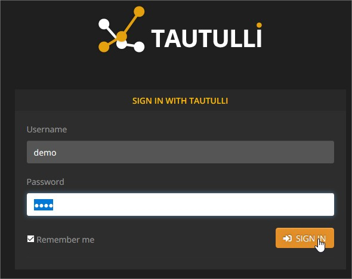

Quand vous apprendrez à utiliser correctement Tautulli, vous pourrez par exemple, créer des notifications chaque fois qu'un nouveau fichier sera ajouté à vôtre bibliothèque. Pour cela, ben, allez faire un tour sur le [wiki sur GitHub](https://github.com/Tautulli/Tautulli-Wiki/wiki)...

Pour ma part, j'ai créé des notifications e-mails, formatées par mes soins, pour que les utilisateurs de Plex sur mon serveur, soient informés de la mise à jour des bibliothèques.

[Visualiser un exemple](https://mysb.gitbook.io/doc/v/v5.3_fr/les-mails/tautulli-bibliotheque-mise-a-jour)

