# Let's go !

## Lancement de l'installation

Connectez-vous en SSH à vôtre serveur avec le compte **ROOT**.  
Puis lancez la commande suivante pour récupérer le script d'installation.

`wget --no-check-certificate -N https://raw.githubusercontent.com/toulousain79/MySB/v5.3/install/MySB_Install.bsh`

Ensuite, exécutez-le.

`bash MySB_Install.bsh`

Selon la localisation du serveur, une langue par défaut sera chargée, soit le français, soit l'anglais.  
Si vous voulez forcer la langue, il suffit de le préciser en argument.

**Pour l'anglais:**

`bash MySB_Install.bsh en`

**Pour le français:**

`bash MySB_Install.bsh fr` 

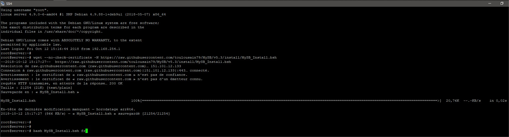

## Sommaire de l'installation

### Choix du répertoire d'installation

A ce stade, les pré-requis de base sont vérifiés, et les étapes du déroulement de l'installation affichées.

Répondez à la question **Êtes-vous prêt à installer MySB** ? En tapant **oui** ou **o**.

Ensuite, vous pouvez valider le répertoire d'installation par défaut en tapant sur **Entrée**.  
Ou saisissez un autre emplacement si vous savez ce que vous faites. Le répertoire doit être absolut, c'est à dire qu'il doit commencer par / en préfixe du chemin. Et ne doit pas contenir de **/** à la fin.

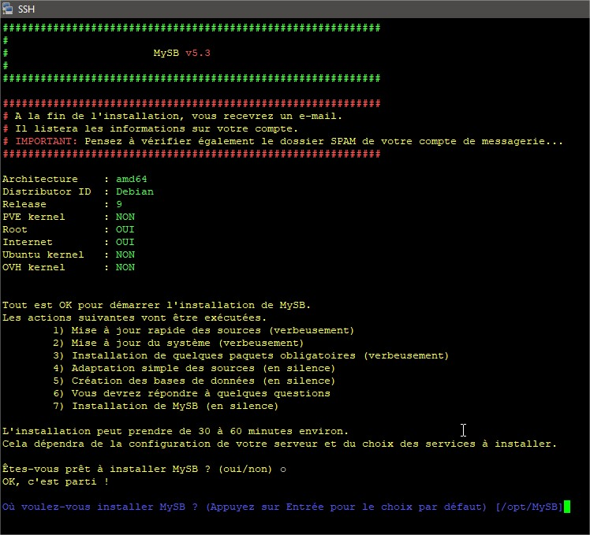

### Préparatifs

Les préparatifs commencent.  
Nous mettons d'abord à jour les listes sources de Debian.

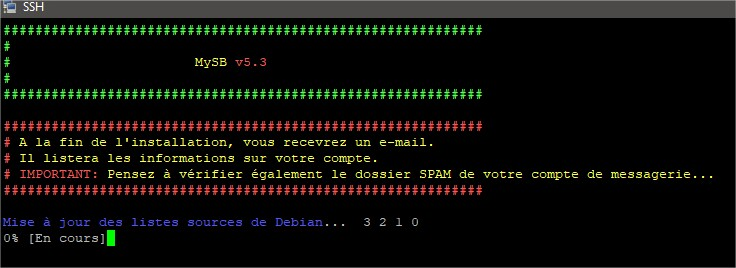

Puis l'installation de certains paquets nécessaires au reste des opérations.

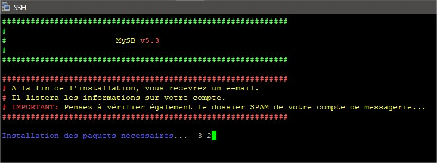

Ensuite, nous téléchargeons le contenu de MySB versionné sur GitHub, à destination du répertoire d'installation choisi, normalement vers **/opt/MySB**. Ces fichiers sont le socle de fonctionnement de MySB.  
Puis, la création de certains répertoires utiles au fonctionnement.  
Et enfin, la création et la population des bases de données MySQL et SQLite.

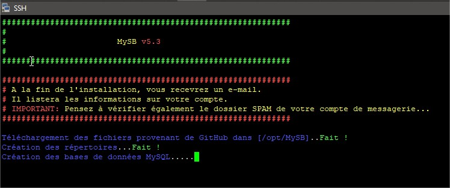

## Questions

Une série de questions vous est proposée.  
Ces questions permettent de personnaliser MySB sur 4 thèmes.  
Hormis les questions sans valeur par défaut, toutes les propositions affichées devraient être suffisante.

Les réponses par défaut seront affichées en **jaune**.  
Il n'est pas nécessaire de retaper la réponse. Une seule pression de la touche **entrée** suffit pour la valider et passer à la question suivante.

En cas de doute, un récapitulatif des question/réponse sera affiché avant de démarrer l'installation. Vous aurez donc la possibilité de revenir en arrière et de modifier ce que vous voudrez.


_**NOTE**: Toutes les réponses peuvent être saisies en minuscule._


### Informations du serveur

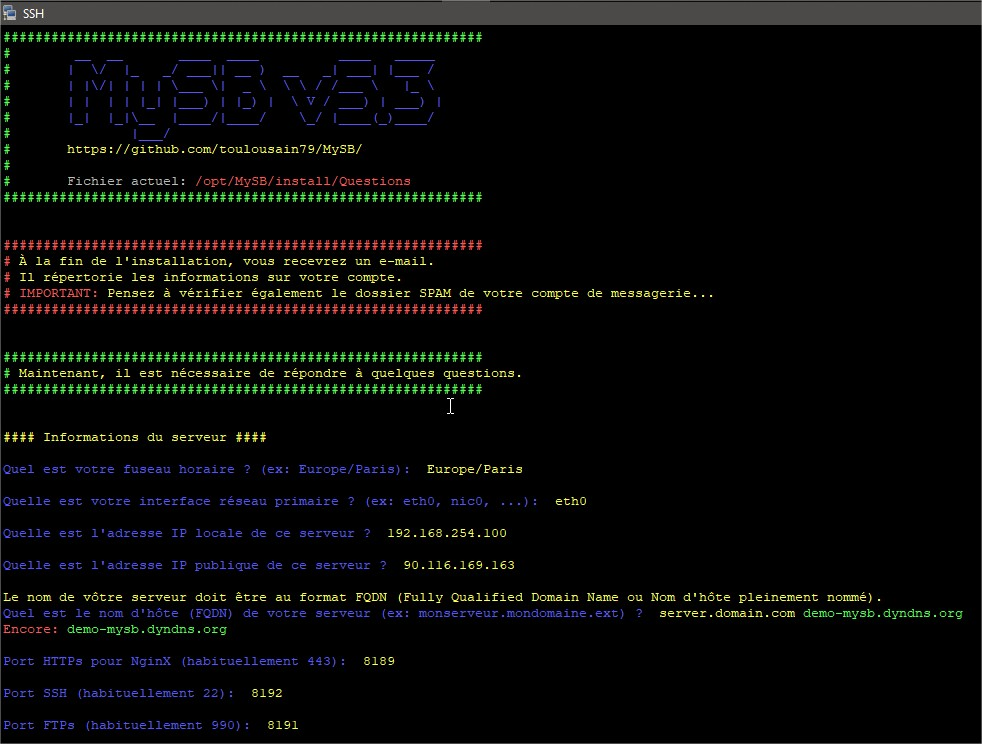

#### Quel est votre fuseau horaire \(timezone\) ?

Vous devez saisir ici le fuseau horaire de vôtre serveur.  
Normalement, celui par défaut est détecté. Mais dans certains cas, il est intéressant de le modifier pour l'adapter à vôtre zone géographique locale. Cas par exemple si vous vous trouvez en France _\(Europe/Paris\)_ alors que vôtre serveur se trouve en Allemagne _\(Europe/Berlin\)_.

Vous trouverez sur [cette page](https://en.wikipedia.org/wiki/List_of_tz_database_time_zones) la liste des fuseaux horaires _\(timezone\)_ existants colonne **TZ**.

#### Quelle est l'interface réseau primaire ?

Généralement, on trouve **eth0** comme interface principale. Mais dans des OS plus récents, l'interface réseau peut porter un autre nom, comme par exemple **ens18**.

Théoriquement, le script d'installation de MySB est capable de trouver l'interface réseau primaire du système. Si tel est le cas, le nom de l'interface sera affichée en jaune comme choix par défaut. Si ce n'est pas le cas, aucun choix proposé, alors vous devrez la trouver et le saisir vous même.

Les commandes généralement utilisées pour identifier l'interface principale sont:

* `ip address`
* `ifconfig`

#### Quelle est l'adresse IP locale de ce serveur ?

Dans certains cas, notamment avec les serveurs loués sur Internet, l'adresse IP locale et la même que l'adresse IP publique. Vous aurez alors le même choix proposé pour ces 2 questions.

Ici, j'utilise un serveur virtuel pour effectuer mes tests et mes démonstrations. Ce serveur dispose alors d'une adresse IP locale unique. L'adresse IP publique étant portée par mon routeur.

Toujours en théorie, le script d'installation est capable de détecter correctement l'adresse IP locale.

#### Quelle est l'adresse IP publique de ce serveur ?

Ici, on parle bien de l'adresse IP **publique**. C'est à dire l'adresse IP qui permettra d'accéder à vôtre serveur depuis Internet. Si par exemple vous disposez d'un serveur dédié, alors il est probable que vous n'ayez qu'une seule IP. Celle-là même qui permettra de se connecter à vôtre serveur depuis Internet.

Toujours en théorie, le script d'installation est capable de détecter correctement l'adresse IP publique, qui pourrait également être l'IP locale du serveur.

#### Quel est le nom d'hôte \(FQDN\) de votre serveur \(ex: monserveur.mondomaine.ext\) ?

C'est le nom d'hôte que vous donnerai à vôtre serveur pour qu'il soit reconnaissable sur Internet.  
**F**ully **Q**ualified **D**omain **N**ame ou Nom d'hôte pleinement nommé, point important pour un fonctionnement optimal de vôtre SeedBox.

Dans le cas d'un serveur local, cela importe peu. Mais dans notre cas, c'est important. En gros, il est nécessaire que ce FQDN soit enregistré sur Internet pour qu'il pointe vers vers l'adresse IP _\(publique\)_ de vôtre serveur.

Par défaut, chez tous les hébergeurs, un FQDN est assigné par défaut de manière générique. Par exemple, on peut retrouver des FQDN de ce type: **sd-**~~**xxxxx**~~**.dedibox.fr**, pour les hébergeurs Online ou Dedimax.

Laisser le FQDN par défaut fonctionnera. Vous pourrez cependant rencontrer des difficultés avec [Let's Encrypt](https://letsencrypt.org/) pour obtenir un certificat SSL valide. Il a été constaté que beaucoup de demande de certificats ont été refusées pour ces FQDN génériques, portant le nom de domaine de l'hébergeur \(ovh.net, dedibox.fr, ...\)

Pour un confort d'utilisation, une sérénité dans le temps, je vous conseille un FQDN différent. Si vous avez un domaine à vous, alors ajoutez une entrée A dans votre zone.  
Mieux encore, je vous conseille l'utilisation de quelque chose de plus générique en passant par des services comme DynDNS.  
Question sécurité, je reste encore septique quant à l'utilisation d'un domaine personnel. Car il peut être plus facile d'obtenir les informations concernant le propriétaire du domaine, et donc de vôtre SeedBox.

Personnellement, et comme illustré dans la copie d'écran, j'utilise DynDNS. Dans l'exemple, je remplace le nom d'hôte par défaut **server.domain.com** par un hôte DynDNS que j'ai créé pour l'exemple, **demo-mysb.dyndns.org**.

Dans tous les cas, vôtre FQDN doit exister et pointer l'adresse IP publique de vôtre serveur.

#### Port HTTPs pour NginX \(habituellement 443\)

Le port désigné par défaut avec MySB sera **8189**.  
Le port par défaut et couramment utilisé sera **443**, celui dédié au HTTPs.

C'est ce port qui sera utilisé pour l'exploitation globale de vôtre SeedBox _\(portail, services web\)_.

Toujours en vue de plus de sécurité et d'anonymat, j'ai préféré changer le port 443 par défaut. Car c'est le port qui sera le plus soumis a des tentatives de connexions frauduleuses, tout comme le 80 pour le HTTP. En soi, ça ne change rien pour une utilisation normale.

Cependant, il est possible de rencontrer quelques difficultés si vous souhaitez accéder à vôtre SeedBox à partir d'un réseau plus sécurisé que la moyenne, bloquant tous les ports exotiques, comme au bureau par exemple.

Là, c'est à vous de voir. Nous ne sommes pas censés utiliser une SeedBox au bureau vous me direz...

#### Port SSH \(habituellement 22\)

Le port désigné par défaut avec MySB sera **8192**.  
Le port par défaut et couramment utilisé est **22**.

Le port SSH **22** étant sûrement le plus attaqué et le plus surveillé au monde je dirais...  
Même principe, pourquoi laisser une porte ouverte à d’éventuelles attaques ?

C'est à vous de choisir.

#### Port FTPs \(habituellement 990\)

Le port par défaut pour le FTPs étant le **990**.  
Nan... Un port différent c'est mieux, enfin je pense.  
Pourquoi pas le **8191** ?

#### Utilisateur principal \(admin\)

Le tout premier compte qui sera créé sur vôtre SeedBox, c'est celui-ci. 

#### Nom d'utilisateur pour l'utilisateur principal de votre SeedBox

Je pense qu'il n'y a pas grand chose à dire ici...

#### Mot de passe pour l'utilisateur principal \(SANS espaces\)

Ici non plus d'ailleurs...

#### Quel est votre fournisseur de SMTP ?

Il s'agit du mode de transport des mails qui seront envoyés à partir de votre SeedBox. Il est possible que ces mails soient envoyés directement à partir de votre serveur. Ou alors, les transmettre à un relais de messagerie comme Gmail ou OVH.

Les choix actuels possibles sont:

* LOCAL
* FREE
* OVH
* GMAIL
* YAHOO
* ZOHO

Tous ces relais de messagerie _\(sauf LOCAL\)_, utilisent le protocole SSL.  
L'avantage de passer par l'un de ces relais est d'éviter que vos mails ne soient classés comme SPAM. Vous devez disposer d'un compte mail valide chez l'un de ces prestataires pour l'utiliser. Je vous conseille de créer un compte dédié à l'utilisation de votre serveur.

Dans le cas de **FREE**, **OVH**, **GMAIL**, **YAHOO** ou **ZOHO**, trois questions vous seront posées.

#### Quel est le nom d'utilisateur pour ce serveur SMTP ?

Le nom d'utilisateur du compte mail à utiliser, généralement c'est l'adresse mail elle-même.

#### Quel est le mot de passe pour ce serveur SMTP ?

Le mot de passe du compte mail.

#### Quelle est votre adresse e-mail ?

Votre adresse mail si jamais elle serait différente du nom d'utilisateur. A savoir, quel est l'adresse mail qui sera liée à votre compte principal _\(admin\)_. C'est également cette adresse qui sera utilisée comme expéditeur pour l'envoie de mails aux autres utilisateurs.

Si vous n'avez pas de compte chez l'un de ces 4 fournisseurs, ou ne voulez pas en utiliser, choisissez **LOCAL**. Dans ce cas, une seule question vous sera posée ensuite. A savoir, quel est l'adresse mail qui sera lié à votre compte principal _\(admin\)_. C'est également cette adresse qui sera utilisée comme expéditeur pour l'envoie de mails aux autres utilisateurs.

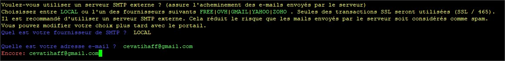

### Services

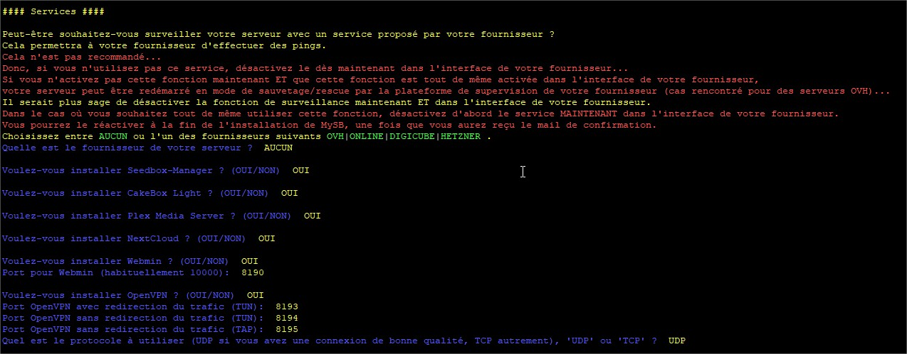

#### Quelle est le fournisseur de votre serveur ?

Choix possibles:

* AUCUN
* OVH
* ONLINE
* DIGICUBE
* HETZNER

Ici, vous pouvez activer ou non le service de monitoring de votre hébergeur, **uniquement** pour le **PING**. Cela ajoutera automatiquement la ou les adresses IPs de l'hébergeur aux règles de sécurité de MySB pour quelles soient autorisées à effectuer des PING.  
Ceci n'est pas une obligation, dans ce cas, saisissez **AUCUN** ou tapez juste sur **Entrée**. Mais pensez à désactiver cette option dans l'interface de gestion de votre hébergeur. Car celle-ci est souvent activée par défaut.

Cependant, vous devez rester conscient des risques engendrés si vous ne suivez pas scrupuleusement l'ordre d'activation. Il est important de respecter ce qui est indiqué en rouge.

SI vous souhaitez autoriser les systèmes de votre hébergeur à vérifier l'activité de votre serveur avec des PINGs, vous devez respecter l'ordre suivant:

1. désactiver cette fonction via l'interface de gestion de l'hébergeur;
2. activer la fonction ici à cette question en donnant le nom de votre hébergeur s'il est présent dans la liste;
3. attendre la fin de l'installation de MySB;
4. activer à nouveau l'option dans l'interface de gestion de votre hébergeur.


_**NOTE**: Si vous ne respectez pas cette ordre, votre serveur pourrez être redémarré automatiquement par votre hébergeur, alors même que l'installation de MySB ne soit pas terminée !_


#### Voulez-vous installer Seedbox-Manager ? \(OUI/NON\)

Seedbox-Manager consomme peu de ressources système, et peut être utile pour télécharger le fichier de configuration de FileZilla _\(FTPs et sFTP\)_, ainsi que celui de l'application Transdroid.  
Seedbox-Manager sera disponible pour tous les utilisateurs "normaux", à savoir disposant d'une session rTorrent.

Lien GitHub: [https://github.com/Magicalex/seedbox-manager](https://github.com/Magicalex/seedbox-manager)  
Statut projet: Inactif

Le choix par défaut étant **oui**, tapez seulement sur **Entrée** pour l'installer. Sinon, saisissez **non**.

#### Voulez-vous installer CakeBox Light ? \(OUI/NON\)

Même chose, Cakebox consomme peu de ressources système. Cakebox sera disponible pour tous les utilisateurs "normaux", à savoir disposant d'une session rTorrent. C'est un outil pratique et simple pour la lecteur de fichiers multimédia. Ne représente que peu d’intérêt si vous installez Plex Media Server, mais peut parfois dépanner.

Lien GitHub: [https://github.com/Cakebox/Cakebox](https://github.com/Cakebox/Cakebox)  
Statut projet: Inactif

Le choix par défaut étant **oui**, tapez seulement sur **Entrée** pour l'installer. Sinon, saisissez **non**.

#### Voulez-vous installer Plex Media Server ? \(OUI/NON\)

L'installation de Plex est judicieuse selon moi.  
Plex peut être un peu chiant à configurer, mais une fois en place, il fonctionne parfaitement bien. Pour l'instant, une seule session Plex est disponible pour tous les utilisateurs "normaux" avec une session rTorrent. Donc, si un autre autre utilisateur "normal" _\(rTorrent\)_ souhaite partager lui-aussi ses bibliothèques avec ses propres amis et/ou famille, vous devrez lui ajouter ses bibliothèques. Il ne sera pas autonome.

Si je décide de continuer le projet, par temps et envie, et en migrant tout ou partie des services sous Docker, il sera possible de fournir une session Plex individuelle par utilisateur "normal", mais avec un port Plex unique par utilisateur, différent de 32400.

En installant Plex, l'outil Tautulli sera également installé.  
Lien GitHub: [https://github.com/Tautulli/Tautulli](https://github.com/Tautulli/Tautulli)  
Statut projet: Actif

Le choix par défaut étant **oui**, tapez seulement sur **Entrée** pour l'installer. Sinon, saisissez **non**.

#### Voulez-vous installer NextCloud ? \(OUI/NON\)

L'installation de NextCloud est judicieuse et peut s'avérer utile. NextCloud peut consommer un peu de ressource, notamment au niveau de NginX et PHP.

NextCloud peut être utile 2 niveaux.

1. Pour synchroniser des dossiers personnels entre plusieurs PC et smartphone;
2. Pour synchroniser le dossier "watch" de rTorrent. Cela permet de disposer localement des dossiers "watch" et ainsi de directement enregistrer les fichiers torrent sur vôtre PC sans avoir à les ajouter via ruTorrent. Ce point sera détaillé dans un autre chapitre.

Le choix par défaut étant **oui**, tapez seulement sur **Entrée** pour l'installer. Sinon, saisissez **non**.

#### Voulez-vous installer Webmin ? \(OUI/NON\)

Bon, je pense que tout le monde connaît Webmin.  
Vous ne devriez pas vous en servir, normalement, vous pourriez même "casser" MySB, tant dans son fonctionnement que pour les mises à jour de MySB.  
**Vous devez donc absolument savoir ce que vous faites !**

#### Port pour Webmin \(habituellement 10000\)

Le port par défaut de Webmin est **10000**.  
****Le port sélectionné pour MySB est **8190**.

Le choix par défaut étant **8190**, tapez seulement sur **Entrée** pour valider. Sinon, saisissez le port désiré en faisant attention de ne pas le mettre en doublon avec un autre.

#### Voulez-vous installer OpenVPN ? \(OUI/NON\)

OpenVPN peut être utilisé de différentes manières en fonction de la méthode de connexion.  
Si vous installez OpenVPN, 4 questions vous seront posées.

Le choix par défaut étant **oui**, tapez seulement sur **Entrée** pour l'installer. Sinon, saisissez **non**.

#### Port OpenVPN avec redirection du trafic \(TUN\)

Le port sélectionné pour MySB est **8193**.

**Possibilités**:

* communication privée avec votre SeedBox
  * partage Samba \(/home/utilisateur\)
  * partage NFS \(/home/utilisateur/rtorrent\)
  * accès HTTPs \(portail MySB, ruTorrent, NextCLoud, ...\) 
  * accès SSH
  * accès FTPs et sFTP
* trafic Internet via l'adresse IP de votre serveur et non l'IP de votre FAI _\(**non recommandé** pour récupérer des fichiers torrent\)_
* connexion routée

#### Port OpenVPN sans redirection du trafic \(TUN\)

Le port sélectionné pour MySB est **8194**.

**Possibilités**:

* communication privée avec votre SeedBox
  * partage Samba _\(/home/utilisateur\)_
  * partage NFS _\(/home/utilisateur OU /export/utilisateur\)_
  * accès HTTPs _\(portail MySB, ruTorrent, NextCLoud, ...\)_
  * accès SSH
  * accès FTPs et sFTP
* connexion routée

#### Port OpenVPN sans redirection du trafic \(TAP\)

Le port sélectionné pour MySB est **8195**.

**Possibilités**:

* communication privée avec votre SeedBox
  * partage Samba _\(/home/utilisateur\)_
  * partage NFS _\(/home/utilisateur OU /export/utilisateur\)_
  * accès HTTPs _\(portail MySB, ruTorrent, NextCLoud, ...\)_
  * accès SSH
  * accès FTPs et sFTP
* connexion bridgé


_**NOTE**: Ce mode n'est pas maintenu et non terminé._


#### Quel est le protocole à utiliser \(UDP si vous avez une connexion de bonne qualité, TCP autrement\), 'UDP' ou 'TCP' ?

Le protocole par défaut pour MySB est **UDP**.

Comme précisé, si vous disposez d'une connexion Internet stable, il est recommandé de conserver le protocole UDP permettant de réduire le nombre de paquets transmis et augmentent donc le débit de la connexion OpenVPN. Une connexion stable est une connexion avec une faible perte de paquets. Vous aurez la possibilité de modifier ce protocole via le portail par la suite.

### Sécurité

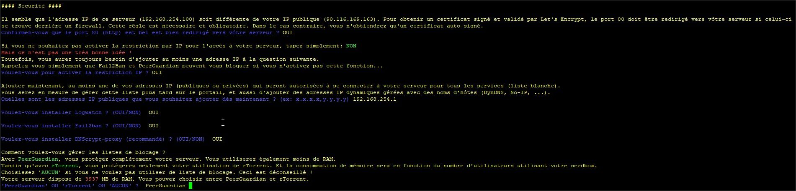

#### Confirmez-vous que le port 80 \(http\) est bel et bien redirigé vers vôtre serveur ?

Cette question s'affichera **uniquement** si l'adresse IP locale de votre serveur est différente de celle votre connexion Internet. Ce sera le cas si votre serveur derrière se trouve derrière un routeur. Dans ce cas il sera nécessaire et à votre charge de rediriger tous les ports réseaux nécessaires pour le bon fonctionnement de votre SeedBox.

Ici, vous devez impérativement rediriger le port **80** _\(HTTP\)_ vers votre serveur. Ce port sera utilisé par Let's Encrypt pour obtenir un certificat signé et valide pour vous connecter en HTTPs à votre SeedBox. Comme les certificats obtenus sont limités dans le temps _\(3 mois\)_, un renouvellement automatique sera effectué régulièrement par Let's Encrypt.  
Le port **80** doit donc être redirigé de manière **permanente** vers votre serveur.

Si vous ne pouvez ou ne voulez pas, l'accès à votre interface et vos services en HTTPs fonctionnera aussi, MAIS vous aurez une alerte de sécurité à chaque fois dans vôtre navigateur. A moins que vous autorisiez le certificat auto-signé via votre navigateur comme peut le proposer Firefox.

Le choix par défaut étant **oui**, tapez seulement sur **Entrée** pour l'installer. Sinon, saisissez **non**.

#### Voulez-vous activer la restriction IP ?

Activer ou non la restriction par adresse IP à votre SeedBox _\(cf._ [_Restriction par adresse IP_](https://mysb.gitbook.io/doc/v/v5.3_fr/securite/restriction-par-adresse-ip)_\)_.  
Je recommande l'activation de cette option.  
Chaque utilisateur "normal", aura la possibilité d'ajouter autant d'adresse IP ou nom d'hôte qu'il le souhaite via le portail.

Quoi qu'il en soit, vous devrez tout de même ajouter au moins votre adresse courante à la question suivante pour le bon déroulement de l'installation.

Si vous n'activez pas la restriction par IP, et que vous vous connecter à SeedBox en utilisant une adresse IP dynamique, alors vous pourriez vous faire bloquer par Fail2Ban et/ou PeerGuardian.  
En effet, encore beaucoup, voir même une majorité de FAI fournissent des IP dynamiques à tous ces abonnés. Un redémarrage de votre box, et hop une nouvelle IP...  
Et là, ça peut devenir problématique.

Mais, toutes les box du marché inclus _\(normalement\)_ une option DynDNS. Mais toutes les box ne proposent pas les mêmes fournisseurs de DNS dynamiques.

Dans l'exemple ci-dessous, il s'agit de la page de configuration du DynDNS pour une Livebox 4 d'Orange. Donc, pour la Livebox 4, seuls les fournisseurs suivants sont disponibles:

* [No-IP](https://www.noip.com/)
* DtDNS _\(fermé depuis août 2018 ?\)_
* [ChangeIP](https://www.changeip.com/)
* DNSdynamic _\(fermé ?\)_ 

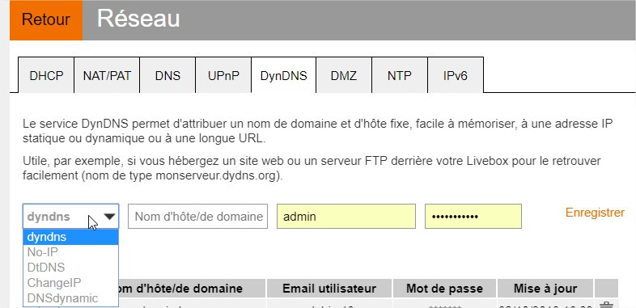

Jetez un œil au chapitre [Fournisseurs DynDNS](https://mysb.gitbook.io/doc/v/v5.3_fr/fournisseurs/fournisseurs-dyndns).

Le choix par défaut étant **oui**, tapez seulement sur **Entrée** pour l'installer. Sinon, saisissez **non**.

#### Quelles sont les adresses IP publiques que vous souhaitez ajouter dès maintenant ? \(ex: x.x.x.x,y.y.y.y\)

Par défaut, l'adresse IP à partir de laquelle vous être connecté à votre serveur pour l'installation est détectée. Vous pouvez en ajoutant plus, mais ce n'est généralement pas utile. A ce stade, vous ne pouvez ajouter que des adresses IP séparées par une virgule et sans espace. Les nom d'hôte ne sont pas acceptés.

Par la suite, vous pourrez ajouter des noms d'hôte et des IP via le portail MySB.

Le choix par défaut est votre adresse IP source _\(celle à partir de laquelle vous être connecté\)_, tapez seulement sur **Entrée** pour l'ajouter.

#### Voulez-vous installer Logwatch ? \(OUI/NON\)

Logwatch est un utilitaire permettant de surveiller les journaux système et de créer des rapports. Ces rapports comprennent les tentatives de connexion infructueuses, les tentatives de connexion réussie, l'espace de stockage utilisé/disponible, les erreurs de kernel, etc.

Le choix par défaut étant **oui**, tapez seulement sur **Entrée** pour l'installer. Sinon, saisissez **non**.

#### Voulez-vous installer Fail2ban \(recommandé\) ? \(OUI/NON\)

[Fail2Ban ](https://www.fail2ban.org/wiki/index.php/Main_Page)est une application qui analyse les logs de divers services _\(SSH, Apache, FTP…\)_ en cherchant des correspondances entre des motifs définis dans ses filtres et les entrées des logs. Lorsqu'une correspondance est trouvée une ou plusieurs actions sont exécutées.  
Typiquement, Fail2Ban cherche des tentatives répétées de connexions infructueuses dans les logs et procède à un bannissement en ajoutant une règle au pare-feu [IPtables ](https://doc.ubuntu-fr.org/iptables)pour bannir l'adresse IP de la source.

Il est **recommandé** d'installer Fail2Ban.

Le choix par défaut étant **oui**, tapez seulement sur **Entrée** pour l'installer. Sinon, saisissez **non**.

#### Voulez-vous installer DNScrypt-proxy \(recommandé\) ? \(OUI/NON\)

[DNSCrypt-proxy](https://github.com/jedisct1/dnscrypt-proxy) est un protocole qui authentifie les communications entre un client DNS et un résolveur [DNS](https://fr.wikipedia.org/wiki/DNS). Cela empêche la falsification de DNS. Il utilise des signatures cryptographiques pour vérifier que les réponses proviennent du résolveur DNS choisi et n'ont pas été falsifiées. C'est une spécification ouverte, avec des implémentations de référence gratuites et open-source, et elle n'est affiliée à aucune entreprise ni organisation.

Il est **recommandé** d'installer DNScrypt-proxy.

Le choix par défaut étant **oui**, tapez seulement sur **Entrée** pour l'installer. Sinon, saisissez **non**.

#### 'PeerGuardian' OU 'rTorrent' OU 'AUCUN' ?

Comment voulez-vous gérer les listes de blocage ?  
Le mieux, si votre configuration matérielle vous le permet, est de choisir [PeerGuardian](https://sourceforge.net/p/peerguardian/wiki/pgl-Main/).

Avec PeerGuardian, la gestion des listes de blocage est globale à votre SeedBox, contrairement avec rTorrent qui les gérera individuellement par utilisateur disposant d'une session rTorrent _\(consomme beaucoup plus de ressource\)_. Si jamais le service PeerGuardian ne peut pas être démarré pour une raison ou une autre, alors rTorrent sera redémarré pour gérer lui-même les listes.

Si vous n'activez pas la gestion des listes de blocage en sélectionnant **AUCUN**, vous ne serez plus protégé correctement.

Il est **recommandé** d'utiliser PeerGuardian.

Le choix par défaut étant **PeerGuardian**, tapez seulement sur **Entrée** pour l'installer. Sinon, saisissez un autre choix.

### Statistiques

#### Voulez-vous signaler votre installation à toulousain79 ?

Ceci est facultatif à l'utilisation de MySB.  
Mais je vous demande de bien vouloir y répondre **OUI**. Cela flatte mon égo ;-\)

Cela me permet de savoir combien de fois MySB est installé, s'il y a eu des mises à jours de faites, la date et le pays du serveur.  
**Aucune** information personnelle n'est collectée.

Le choix par défaut étant **oui**, tapez seulement sur **Entrée** pour l'installer. Sinon, saisissez **non**.

## Récapitulatif 

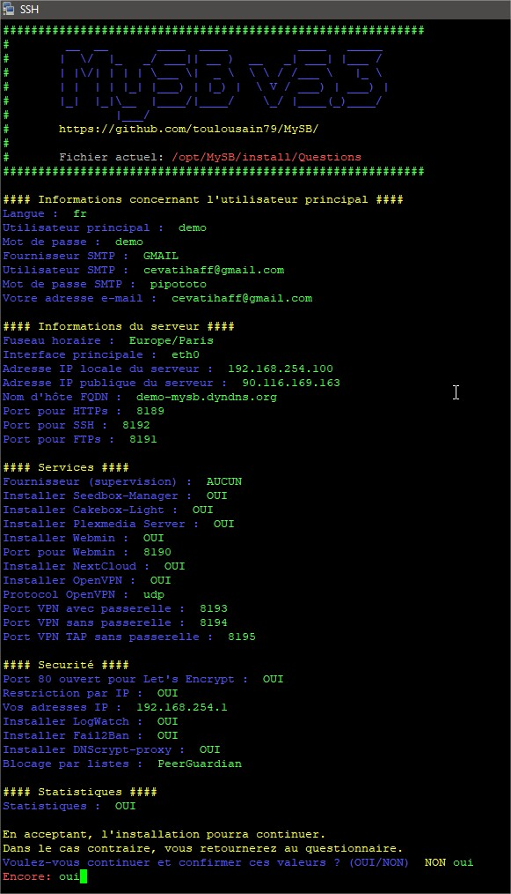

Vérifiez si vous êtes d'accord avec vos choix.  
Si vous souhaitez modifier quelque chose, appuyez sont la touche **Entrée** pour parcourir à nouveau le questionnaire et appliquer vos modifications.

Dans le cas contraire, saisissez **oui** pour valider et continuer.

## Confirmation

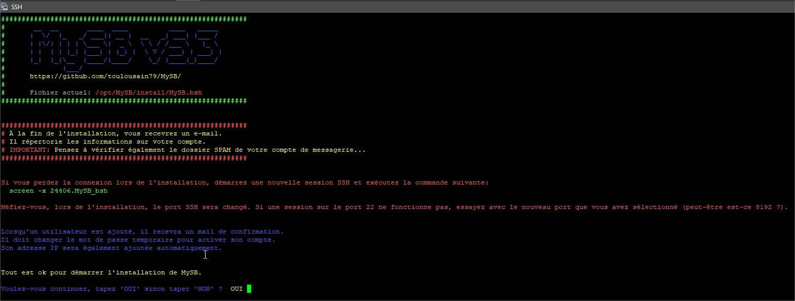

C'est la dernière question avant de lancer l'installation de MySB.

Cela précise aussi comment reprendre la main sur l'installation si jamais vous perdiez la main en SSH. Comme l'installation se déroule de manière automatique en tâche de fond, perdre la main ou fermer votre console n'est pas gênant.

Le choix par défaut étant **oui**, tapez seulement sur **Entrée** pour lancer l'installation. Saisissez **non**, pour quitter l'installation.

Pour reprendre la main:

1. relancez votre console, par exemple Putty/Kitty;
2. connectez-vous en ROOT;
3. lancez la commande `screen -x MySB_bsh`


_**NOTE**: Le port SSH peut changer durant l'installation. Si le port SSH 22 ne fonctionne plus, essayez avec le port que vous aurez choisi \(ex: **8192** ?\)_


## Déroulement de l'installation

### Étape 1 - Préparation du serveur

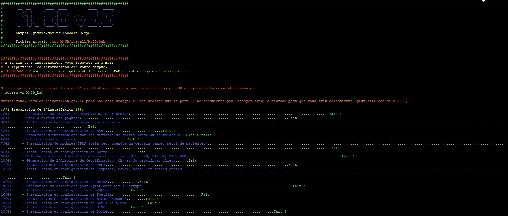

### Étape 2 - Installation de tous les services

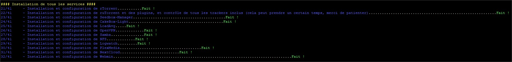

### Étape 3 - Installation des services liés à la sécurité

## Redémarrage du serveur

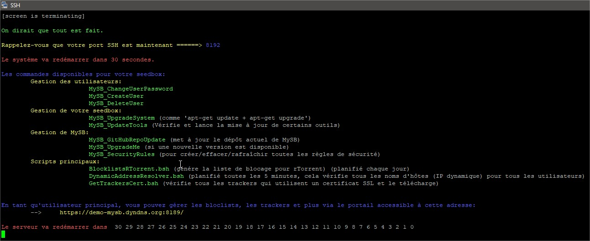

L'installation est terminée et le serveur vient d'être redémarré.  
Il faut **patienter** un moment pour qu'il redémarre et pouvoir ainsi s'y connecter et configurer MySB.

Si vous avez correctement configurer votre compte de messagerie, vous devriez avoir reçu plusieurs mails.

1. MySB - Le mail de confirmation de création du compte principal _\(admin\)_;
2. PeerGuardian - pgld hit statistics, dû aux différents redémarrage du service PeerGuardian durant l'installation;

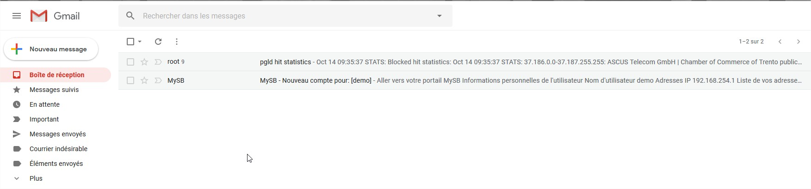

## Mail de confirmation

[Voici un exemple du mail que vous devez recevoir.](https://mysb.gitbook.io/doc/v/v5.3_fr/les-mails/fin-dinstallation)

Vous pouvez dès maintenant vous connecter au portail MySB en cliquant sur le lien **Aller vers votre portail MySB**, en haut à gauche du mail.

