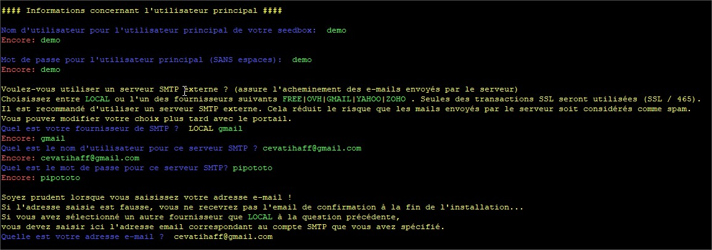

# Let's go !

## Lancement de l'installation

Connectez-vous en SSH à vôtre serveur avec le compte **ROOT**.  
Puis lancez la commande suivante pour récupérer le script d'installation.

`wget --no-check-certificate -N` [`https://raw.githubusercontent.com/toulousain79/MySB/v5.3/install/MySB_Install.bsh`](https://raw.githubusercontent.com/toulousain79/MySB/MySB_Version/install/MySB_Install.bsh)\`\`

Ensuite, exécutez-le.

`bash MySB_Install.bsh`

Selon la localisation du serveur, une langue par défaut sera chargée, soit le français, soit l'anglais.  
Si vous voulez forcer la langue, il suffit de le préciser en argument.

**Pour l'anglais:**

`bash MySB_Install.bsh en`

**Pour le français:**

`bash MySB_Install.bsh fr` 

## Sommaire de l'installation

### Choix du répertoire d'installation

A ce stade, les pré-requis de base sont vérifiés, et les étapes du déroulement de l'installation affichées.

Répondez à la question **Êtes-vous prêt à installer MySB** ? En tapant **oui** ou **o**.

Ensuite, vous pouvez valider le répertoire d'installation par défaut en tapant sur **Entrée**.  
Ou saisissez un autre emplacement si vous savez ce que vous faites. Le répertoire doit être absolut, c'est à dire qu'il doit commencer par / en préfixe du chemin. Et ne doit pas contenir de **/** à la fin.

### Préparatifs

Les préparatifs commencent.  
Nous mettons d'abord à jour les listes sources de Debian.

Puis l'installation de certains paquets nécessaires au reste des opérations.

Ensuite, nous téléchargeons le contenu de MySB versionné sur GitHub, à destination du répertoire d'installation choisi, normalement vers **/opt/MySB**. Ces fichiers sont le socle de fonctionnement de MySB.  
Puis, la création de certains répertoires utiles au fonctionnement.  
Et enfin, la création et la population des bases de données MySQL et SQLite.

## Questions

Une série de questions vous est proposée.  
Ces questions permettent de personnaliser MySB sur 4 thèmes.  
Hormis les questions sans valeur par défaut, toutes les propositions affichées devraient être suffisante.

Les réponses par défaut seront affichées en **jaune**.  
Il n'est pas nécessaire de retaper la réponse. Une seule pression de la touche **entrée** suffit pour la valider et passer à la question suivante.

En cas de doute, un récapitulatif des question/réponse sera affiché avant de démarrer l'installation. Vous aurez donc la possibilité de revenir en arrière et de modifier ce que vous voudrez.


_**NOTE**: Toutes les réponses peuvent être saisies en minuscule._


### Informations du serveur

#### Quel est votre fuseau horaire \(timezone\) ?

Vous devez saisir ici le fuseau horaire de vôtre serveur.  
Normalement, celui par défaut est détecté. Mais dans certains cas, il est intéressant de le modifier pour l'adapter à vôtre zone géographique locale. Cas par exemple si vous vous trouvez en France _\(Europe/Paris\)_ alors que vôtre serveur se trouve en Allemagne _\(Europe/Berlin\)_.

Vous trouverez sur [cette page](https://en.wikipedia.org/wiki/List_of_tz_database_time_zones) la liste des fuseaux horaires _\(timezone\)_ existants colonne **TZ**.

#### Quelle est l'interface réseau primaire ?

Généralement, on trouve **eth0** comme interface principale. Mais dans des OS plus récents, l'interface réseau peut porter un autre nom, comme par exemple **ens18**.

Théoriquement, le script d'installation de MySB est capable de trouver l'interface réseau primaire du système. Si tel est le cas, le nom de l'interface sera affichée en jaune comme choix par défaut. Si ce n'est pas le cas, aucun choix proposé, alors vous devrez la trouver et le saisir vous même.

Les commandes généralement utilisées pour identifier l'interface principale sont:

* `ip address`
* `ifconfig`

#### Quelle est l'adresse IP locale de ce serveur ?

Dans certains cas, notamment avec les serveurs loués sur Internet, l'adresse IP locale et la même que l'adresse IP publique. Vous aurez alors le même choix proposé pour ces 2 questions.

Ici, j'utilise un serveur virtuel pour effectuer mes tests et mes démonstrations. Ce serveur dispose alors d'une adresse IP locale unique. L'adresse IP publique étant portée par mon routeur.

Toujours en théorie, le script d'installation est capable de détecter correctement l'adresse IP locale.

#### Quelle est l'adresse IP publique de ce serveur ?

Ici, on parle bien de l'adresse IP **publique**. C'est à dire l'adresse IP qui permettra d'accéder à vôtre serveur depuis Internet. Si par exemple vous disposez d'un serveur dédié, alors il est probable que vous n'ayez qu'une seule IP. Celle-là même qui permettra de se connecter à vôtre serveur depuis Internet.

Toujours en théorie, le script d'installation est capable de détecter correctement l'adresse IP publique, qui pourrait également être l'IP locale du serveur.

#### Quel est le nom d'hôte \(FQDN\) de votre serveur \(ex: monserveur.mondomaine.ext\) ?

C'est le nom d'hôte que vous donnerai à vôtre serveur pour qu'il soit reconnaissable sur Internet.  
**F**ully **Q**ualified **D**omain **N**ame ou Nom d'hôte pleinement nommé, point important pour un fonctionnement optimal de vôtre SeedBox.

Dans le cas d'un serveur local, cela importe peu. Mais dans notre cas, c'est important. En gros, il est nécessaire que ce FQDN soit enregistré sur Internet pour qu'il pointe vers vers l'adresse IP _\(publique\)_ de vôtre serveur.

Par défaut, chez tous les hébergeurs, un FQDN est assigné par défaut de manière générique. Par exemple, on peut retrouver des FQDN de ce type: **sd-**~~**xxxxx**~~**.dedibox.fr**, pour les hébergeurs Online ou Dedimax.

Laisser le FQDN par défaut fonctionnera. Vous pourrez cependant rencontrer des difficultés avec [Let's Encrypt](https://letsencrypt.org/) pour obtenir un certificat SSL valide. Il a été constaté que beaucoup de demande de certificats ont été refusées pour ces FQDN génériques, portant le nom de domaine de l'hébergeur \(ovh.net, dedibox.fr, ...\)

Pour un confort d'utilisation, une sérénité dans le temps, je vous conseille un FQDN différent. Si vous avez un domaine à vous, alors ajoutez une entrée A dans votre zone.  
Mieux encore, je vous conseille l'utilisation de quelque chose de plus générique en passant par des services comme DynDNS.  
Question sécurité, je reste encore septique quant à l'utilisation d'un domaine personnel. Car il peut être plus facile d'obtenir les informations concernant le propriétaire du domaine, et donc de vôtre SeedBox.

Personnellement, et comme illustré dans la copie d'écran, j'utilise DynDNS. Dans l'exemple, je remplace le nom d'hôte par défaut **server.domain.com** par un hôte DynDNS que j'ai créé pour l'exemple, **demo-mysb.dyndns.org**.

Dans tous les cas, vôtre FQDN doit exister et pointer l'adresse IP publique de vôtre serveur.

#### Port HTTPs pour NginX \(habituellement 443\)

Le port désigné par défaut avec MySB sera **8189**.  
Le port par défaut et couramment utilisé sera **443**, celui dédié au HTTPs.

C'est ce port qui sera utilisé pour l'exploitation globale de vôtre SeedBox _\(portail, services web\)_.

Toujours en vue de plus de sécurité et d'anonymat, j'ai préféré changer le port 443 par défaut. Car c'est le port qui sera le plus soumis a des tentatives de connexions frauduleuses, tout comme le 80 pour le HTTP. En soi, ça ne change rien pour une utilisation normale.

Cependant, il est possible de rencontrer quelques difficultés si vous souhaitez accéder à vôtre SeedBox à partir d'un réseau plus sécurisé que la moyenne, bloquant tous les ports exotiques, comme au bureau par exemple.

Là, c'est à vous de voir. Nous ne sommes pas censés utiliser une SeedBox au bureau vous me direz...

#### Port SSH \(habituellement 22\)

Le port désigné par défaut avec MySB sera **8192**.  
Le port par défaut et couramment utilisé est **22**.

Le port SSH **22** étant sûrement le plus attaqué et le plus surveillé au monde je dirais...  
Même principe, pourquoi laisser une porte ouverte à d’éventuelles attaques ?

C'est à vous de choisir.

#### Port FTPs \(habituellement 990\)

Le port par défaut pour le FTPs étant le **990**.  
Nan... Un port différent c'est mieux, enfin je pense.  
Pourquoi pas le **8191** ?

#### Utilisateur principal \(admin\)

Le tout premier compte qui sera créé sur vôtre SeedBox, c'est celui-ci. 

#### Nom d'utilisateur pour l'utilisateur principal de votre SeedBox

Je pense qu'il n'y a pas grand chose à dire ici...

#### Mot de passe pour l'utilisateur principal \(SANS espaces\)

Ici non plus d'ailleurs...

#### Quel est votre fournisseur de SMTP ?

Il s'agit du mode de transport des mails qui seront envoyés à partir de votre SeedBox. Il est possible que ces mails soient envoyés directement à partir de votre serveur. Ou alors, les transmettre à un relais de messagerie comme Gmail ou OVH.

Les choix actuels possibles sont:

* LOCAL
* FREE
* OVH
* GMAIL
* YAHOO
* ZOHO

Tous ces relais de messagerie _\(sauf LOCAL\)_, utilisent le protocole SSL.  
L'avantage de passer par l'un de ces relais est d'éviter que vos mails ne soient classés comme SPAM. Vous devez disposer d'un compte mail valide chez l'un de ces prestataires pour l'utiliser. Je vous conseille de créer un compte dédié à l'utilisation de votre serveur.

Dans le cas de **FREE**, **OVH**, **GMAIL**, **YAHOO** ou **ZOHO**, trois questions vous seront posées.

#### Quel est le nom d'utilisateur pour ce serveur SMTP ?

Le nom d'utilisateur du compte mail à utiliser, généralement c'est l'adresse mail elle-même.

#### Quel est le mot de passe pour ce serveur SMTP ?

Le mot de passe du compte mail.

#### Quelle est votre adresse e-mail ?

Votre adresse mail si jamais elle serait différente du nom d'utilisateur. A savoir, quel est l'adresse mail qui sera liée à votre compte principal _\(admin\)_. C'est également cette adresse qui sera utilisée comme expéditeur pour l'envoie de mails aux autres utilisateurs.

Si vous n'avez pas de compte chez l'un de ces 4 fournisseurs, ou ne voulez pas en utiliser, choisissez **LOCAL**. Dans ce cas, une seule question vous sera posée ensuite. A savoir, quel est l'adresse mail qui sera lié à votre compte principal _\(admin\)_. C'est également cette adresse qui sera utilisée comme expéditeur pour l'envoie de mails aux autres utilisateurs.

### Services

#### Quelle est le fournisseur de votre serveur ?

Choix possibles:

* AUCUN
* OVH
* ONLINE
* DIGICUBE
* HETZNER

Ici, vous pouvez activer ou non le service de monitoring de votre hébergeur, **uniquement** pour le **PING**. Cela ajoutera automatiquement la ou les adresses IPs de l'hébergeur aux règles de sécurité de MySB pour quelles soient autorisées à effectuer des PING.  
Ceci n'est pas une obligation, dans ce cas, saisissez **AUCUN** ou tapez juste sur **Entrée**. Mais pensez à désactiver cette option dans l'interface de gestion de votre hébergeur. Car celle-ci est souvent activée par défaut.

Cependant, vous devez rester conscient des risques engendrés si vous ne suivez pas scrupuleusement l'ordre d'activation. Il est important de respecter ce qui est indiqué en rouge.

SI vous souhaitez autoriser les systèmes de votre hébergeur à vérifier l'activité de votre serveur avec des PINGs, vous devez respecter l'ordre suivant:

1. désactiver cette fonction via l'interface de gestion de l'hébergeur;
2. activer la fonction ici à cette question en donnant le nom de votre hébergeur s'il est présent dans la liste;
3. attendre la fin de l'installation de MySB;
4. activer à nouveau l'option dans l'interface de gestion de votre hébergeur.


_**NOTE**: Si vous ne respectez pas cette ordre, votre serveur pourrez être redémarré automatiquement par votre hébergeur, alors même que l'installation de MySB ne soit pas terminée !_


#### Voulez-vous installer Seedbox-Manager ? \(OUI/NON\)

Seedbox-Manager consomme peu de ressources système, et peut être utile pour télécharger le fichier de configuration de FileZilla _\(FTPs et sFTP\)_, ainsi que celui de l'application Transdroid.  
Seedbox-Manager sera disponible pour tous les utilisateurs "normaux", à savoir disposant d'une session rTorrent.

Lien GitHub: [https://github.com/Magicalex/seedbox-manager](https://github.com/Magicalex/seedbox-manager)  
Statut projet: Inactif

Le choix par défaut étant **oui**, tapez seulement sur **Entrée** pour l'installer. Sinon, saisissez **non**.

#### Voulez-vous installer CakeBox Light ? \(OUI/NON\)

Même chose, Cakebox consomme peu de ressources système. Cakebox sera disponible pour tous les utilisateurs "normaux", à savoir disposant d'une session rTorrent. C'est un outil pratique et simple pour la lecteur de fichiers multimédia. Ne représente que peu d’intérêt si vous installez Plex Media Server, mais peut parfois dépanner.

Lien GitHub: [https://github.com/Cakebox/Cakebox](https://github.com/Cakebox/Cakebox)  
Statut projet: Inactif

Personnellement, je l'utilise occasionnellement.

Le choix par défaut étant **oui**, tapez seulement sur **Entrée** pour l'installer. Sinon, saisissez **non**.

