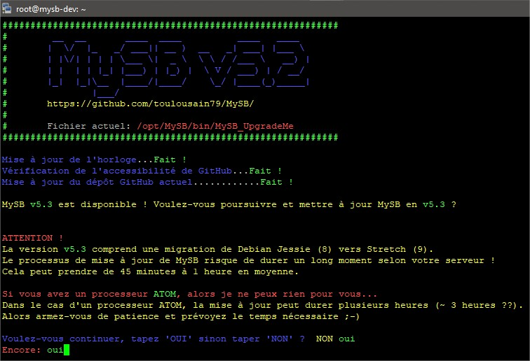
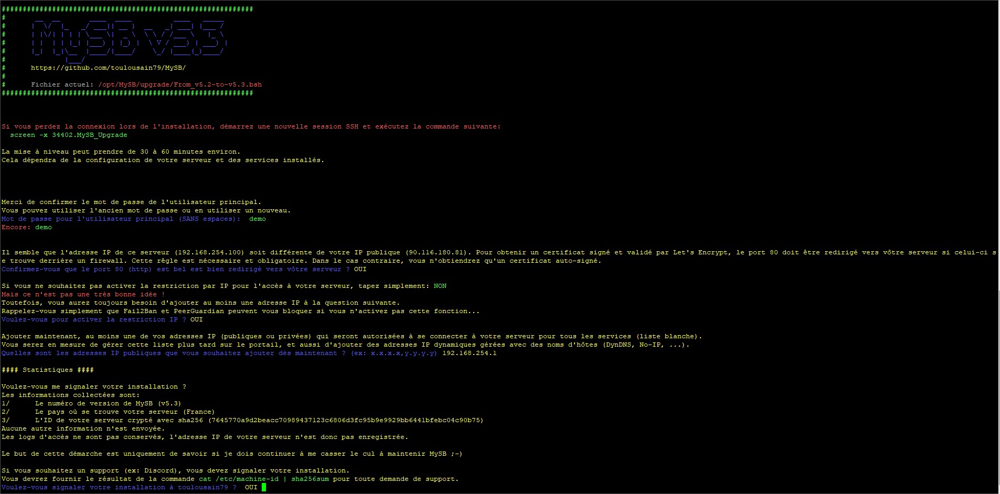
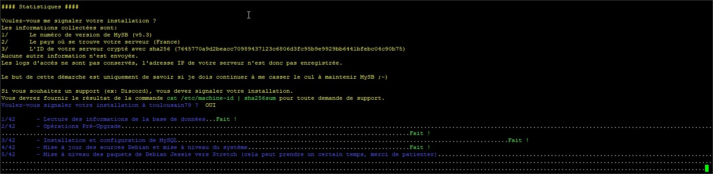
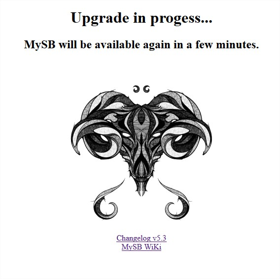
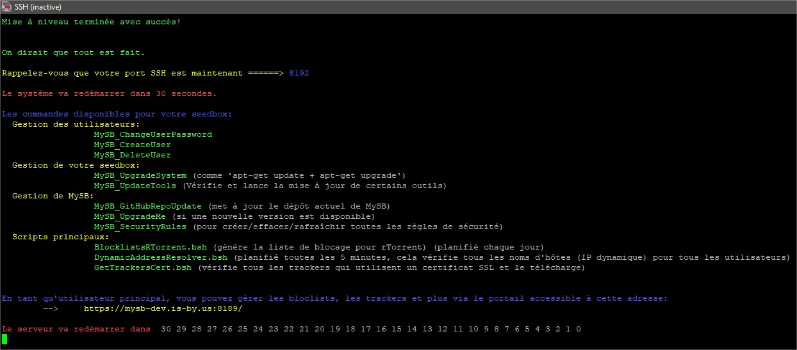

# Mise à jour

## Lancement de la mise à jour

Si une mise à jour est disponible, vous recevrez un mail sans contenu vous l'indiquant. Une tâche programmée est lancée tous les 3 jours.

[Visualisation du mail en cas de mise à jour disponible](https://mysb.gitbook.io/doc/les-mails/nouvelle-version-disponible)


_**NOTE**: Prévoyez le bon moment pour appliquer une mise à jour. Selon les modifications à apporter, cela peut prendre du temps. Les service de vôtre SeedBox seront alors indisponibles durant se laps de temps._


Si une nouvelle version est disponible, vous pouvez procéder à son application. Connectez-vous en SSH en **ROOT** à votre serveur, et lancez la commande suivante:

`MySB_UpgradeMe`

Vous obtiendrez quelque chose comme ça:

Pour continuer et appliquer la mise à jour, tapez **oui**.

Une sauvegarde avec Backup-Manager est lancée, sauvegardant les configurations de Tautulli, Plex Media Server, et générant une archive des dossiers d'installation de MySB **/etc/MySB** et **/opt/MySB**. Un nettoyage est également lancé pour supprimer certains fichiers temporaires, les sources temporaires de certaines applications, et un nettoyage Git de MySB.

A la suite de ça, quelques questions vous seront posées.

### Questions

#### Mot de passe pour l'utilisateur principal \(SANS espaces\)

Vous devez confirmer ou modifier le mot de passe du compte principal.

#### Confirmez-vous que le port 80 \(http\) est bel et bien redirigé vers vôtre serveur ?

[Référez-vous au même chapitre dans la partie installation.](https://mysb.gitbook.io/doc/installation/lets-go#confirmez-vous-que-le-port-80-http-est-bel-et-bien-redirige-vers-votre-serveur)

Le choix par défaut étant **oui**, tapez seulement sur **Entrée** ou **non**.

#### Voulez-vous pour activer la restriction IP ?

[Référez-vous au même chapitre dans la partie installation.](https://mysb.gitbook.io/doc/installation/lets-go#voulez-vous-activer-la-restriction-ip)

Le choix par défaut étant **oui**, tapez seulement sur **Entrée** ou **non**.

#### Quelles sont les adresses IP publiques que vous souhaitez ajouter dès maintenant ? \(ex: x.x.x.x,y.y.y.y\)

[Référez-vous au même chapitre dans la partie installation.](https://mysb.gitbook.io/doc/installation/lets-go#quelles-sont-les-adresses-ip-publiques-que-vous-souhaitez-ajouter-des-maintenant-ex-x-x-x-x-y-y-y-y)

Le choix par défaut est votre adresse IP source, tapez seulement sur **Entrée** pour l'ajouter. Les adresses déjà existantes ajoutées manuellement via le portail, ne seront pas supprimées.

#### Voulez-vous signaler votre installation à toulousain79 ?

[Référez-vous au même chapitre dans la partie installation.](https://mysb.gitbook.io/doc/installation/lets-go#voulez-vous-signaler-votre-installation-a-toulousain79)

Le choix par défaut étant **oui**, tapez seulement sur **Entrée** ou **non**.

## Déroulement de la mise à jour

Dès que vous aurez répondu aux questions, la mise à jour se lancera.

Durant une mise à jour, l'accès au portail est bloqué. Une page d'excuse est affichée à la place.

De la même manière qu'une installation normale, le serveur redémarrera à la fin de la mise à jour. Mais contrairement à une installation, la mise à jour continuera à la fin de redémarrage du serveur pour terminer certaines étapes. Ces étapes restent transparentes et assez rapides. L'étape la plus importante est la fin de la mise à jour de NextCloud _\(s'il y en a une\)_.

Vous recevrez alors un [mail de confirmation de ce type](https://mysb.gitbook.io/doc/les-mails/mise-a-jour-terminee).

