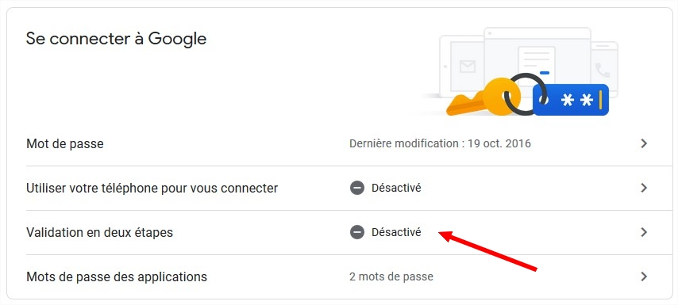
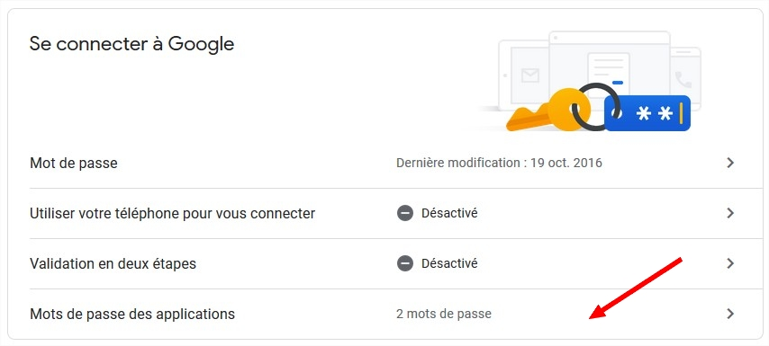
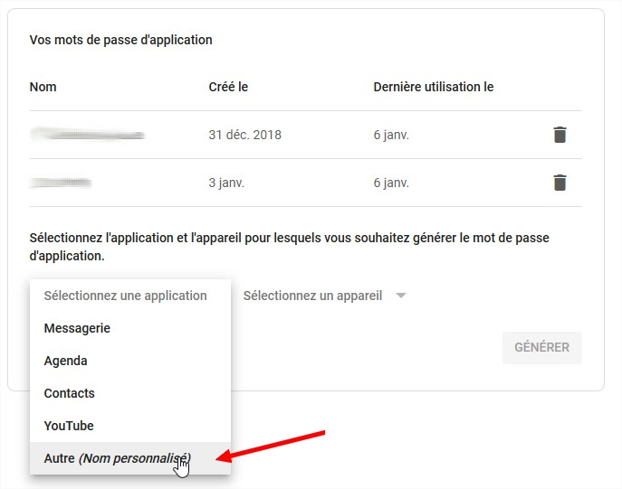
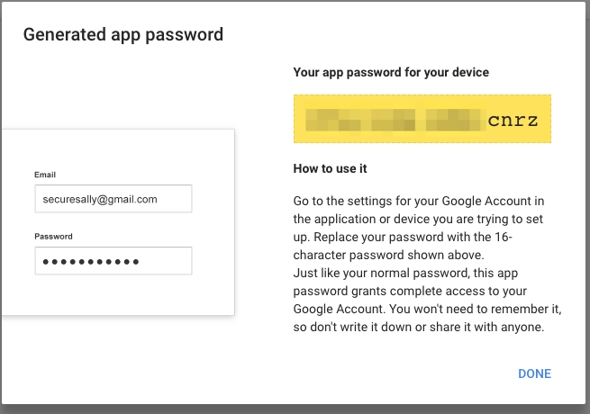

# Pré-requis

## Aperçu rapide


* [x] Faire l'installation en **ROOT**
* [x] Noyau par défaut Debian
* [x] Système de fichier EXT4 _\(**PAS DE LVM !!!**\)_
* [x] 8 Go de RAM minimum
* [x] Processeur 4 cœurs  conseillé _\(éviter les processeurs ATOM\)_
* [x] Compte mail externe très conseillé _\(GMAIL, YAHOO, FREE, ZOHO et OVH\)_
* [x] Nom d'hôte **valide** _\(FQDN\)_ _\(éviter le noms donnés par défaut par l'hébergeur\)_



Raspberry non supportés


## Nom d'hôte / Hostname / FQDN

Il est impératif que vous disposiez d'un nom d'hôte valide pour vôtre serveur, notamment pour un serveur dédié.

Tous les hébergeurs, en majorité, je pense, en fournissant par défaut lors de la livraison.  
Cependant, selon la méthode d'installation mis à disposition de l'hébergeur, il arrive parfois que ce nom d'hôte ne soit pas valide. C'est le cas avec Hetzner avec la méthode d'installation **Mode Rescue** + **installimage**.

A vous de vous en procurer un. Vous n'avez pas de domaine ? Alors utilisez No-IP ou un équivalent par exemple.

## Matériel

Je sais que l'idée de prendre le serveur le moins cher possible compte. Il n'y a pas vraiment de configuration matériel à proprement parlé. C'est à vous de déterminer ce qu'il vous faut.

Cependant, il y a tout de même quelques bases à respecter si possible. Dans tous les cas, l'installation sera possible, ainsi que l'utilisation. Mais vous pourriez rencontrer quelques désagréments lors l’utilisation de Plex par exemple. Ou alors une installation relativement longue.

Le **processeur**, autant que faire ce peu, évitez les processeurs **Atom**.  
C'est vrai, c'est moi cher, mais aussi beaucoup moins rapide, surtout si vous faites du multi-utilisateurs et du Plex.

La **mémoire**, 4 Go ça peut le faire, **8 Go** étant un minimum selon moi, surtout si vous faites du multi-utilisateurs. L'installation sera impossible si vous avez moins de 2 Go, mais pas recommandé.

Le **système**, Debian 9 _\(Strectch\)_ avec le _**noyau par défaut**_ de Debian, un accès **ROOT** et rien d'autre.

L' **espace disque**, ben là, je dois dire que je m'en fout un peu, c'est vôtre problème 😉  
Cela dit, un minimum vital de **6 Go** pour permettre l’installation de MySB, **10 Go** recommandés.  
Il est possible de prendre des serveurs dédiés avec 2 disques pour faire du RAID0.  
Pour un serveur de 2 disques de 3 To, un RAID0 vous donnera 6 To. Mais en faisant cela, je vise plutôt l'accès disque _\(lecture + écriture\)_ qui sera doublé. Le RAID0 peut-être dangereux, car si un disque lâche, on perd toutes les données...  
Je me dis que ces serveurs se trouvent dans des sales blanches, protégés comme il le faut _\(normalement\),_ en tout cas mieux qu'à la maison. C'est également un choix que de choisir des disques **Entreprise** lors de l'acquisition d'un serveur, étant plus fiables. Et je dois dire que les données stockées ne sont pas vitales...

La **bande passante**, le minimum étant une connexion de 100 Mbits.  
On peut trouver des connexions à 250 Mbits et même 1 Gbits. Ça dépendra de vos moyens, mais surtout de vôtre usage. Car si vous avez 5 utilisateurs ou plus en concurrence sur Plex, et bien il faut que le serveur puisse fournir un flux correct pour tout le monde.

**Une configuration intéressante**:

* **Processeur:** Intel i7
* **Mémoire:** 16 Go
* **Disques:** 2x3 To en RAID0 _\(disques Enterprise\)_
* **Réseau:** 1 Gbits
* **Utilisateurs:** 7 _\(ex: 3 normaux avec rTorrent + 4 Plex uniquement en partageant la bibliothèque\)_
* **Prix:** ~31 € / mois \(soit 4,47€ / utilisateur\)

## Système de fichiers

Le système de fichier validé aujourd'hui est le **EXT4** seulement, pour permettre la gestion des quotas !

Inutile de venir trouver de l'aide sur Discord précisant qu'après l'installation vous n'avez plus de nouvelles de vôtre serveur. Si je dois investiguer avec vous et me rendre compte que vous avez formaté en BTRFS, il est probable que je vois rouge...

Le **BTRFS** n'est pas supporté par MySB... ;-\)

Concernant le **LVM**, vous ne devriez pas en avoir besoin dans ce type d'utilisation. Je vous déconseille donc de l'utiliser. Aujourd'hui, je ne peux même pas vous confirmer que cela fonctionnerait et n'aurait pas d'incident dans le fonctionnement de MySB.

## Mails

Si vous souhaitez utiliser un relais de messagerie pour déléguer l'envoie de vos mails, pensez à autoriser des applications externes à se connecter à votre compte de messagerie.

### Gmail

Deux possibilités:

1. Générer un mot de passe pour vos applications \(2FA\) _\(méthode conseillée\)_
2. Autoriser les applications moins sécurisées



Rendez-vous sur [https://myaccount.google.com/security](https://myaccount.google.com/security), identifiez-vous si besoin.

1/ Activez la Validation en deux étapes

Suivez le déroulement des fenêtres, cela peut varier en fonction de vôtre compte.  
Une fois la validation en 2 étapes activées, on passe à la génération d'un mot de passe pour vôtre SeedBox.

2/ Mot de passe des applications

Cliquez sur **Sélectionnez une application**, puis sur **Autre** _**\(Nom personnalisé\)**_, donnez lui un nom _\(ex: MySB\)_.  
Enfin, cliquez sur **Générer**.

Vous obtiendrez un mot de passe **unique** qui remplacera le mot de passe principal de vôtre compte Gmail**.**


Il sera impossible de retrouver ce mot de passe par la suite. Si vous le perdez, vous devrez alors en générer un nouveau !




Dans les paramètres de Gmail, activez l'option **Paramètre "Autoriser les applications moins sécurisées"** disponible sur [**cette page**](https://myaccount.google.com/lesssecureapps).


_**NOTE**: Faites attention d'être connecté avec le bon compte..._


Pour Gmail, il est également probable d'utiliser le lien ci-dessous pour autoriser vôtre serveur à se connecter à vôtre compte mail.  
Pour se faire, suivez les étapes suivantes juste avant l'installation de MySB:

1. Ouvrez ce lien: [https://www.google.com/accounts/DisplayUnlockCaptcha](https://www.google.com/accounts/DisplayUnlockCaptcha)
2. Identifiez-vous avec le compte mail que vous souhaitez utiliser



