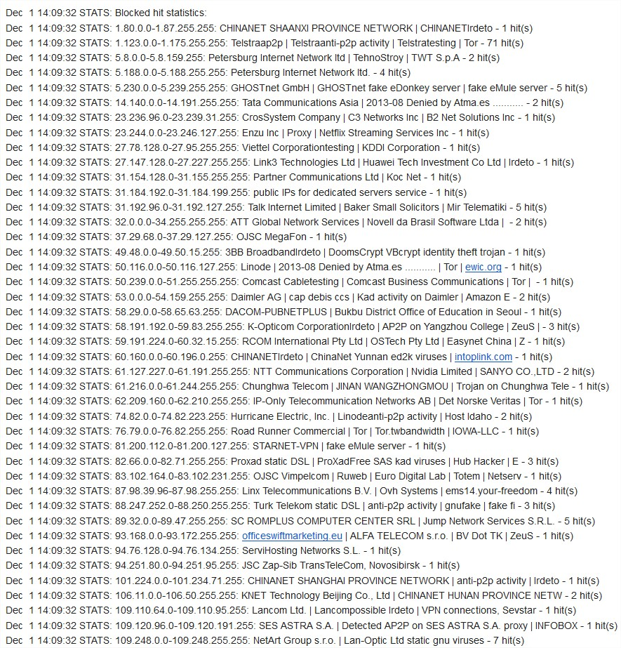

# PeerGuardian, statistiques


Prenez soin de rechercher le mot clé **anti-p2p**...  
Il s'agit que d'un extrait.  
Et pour rappel, **systématiquement**, après avoir installer un nouveau serveur et sans même l'avoir utilisé, on trouve déjà des hits provenant d'organismes anti-p2p...


