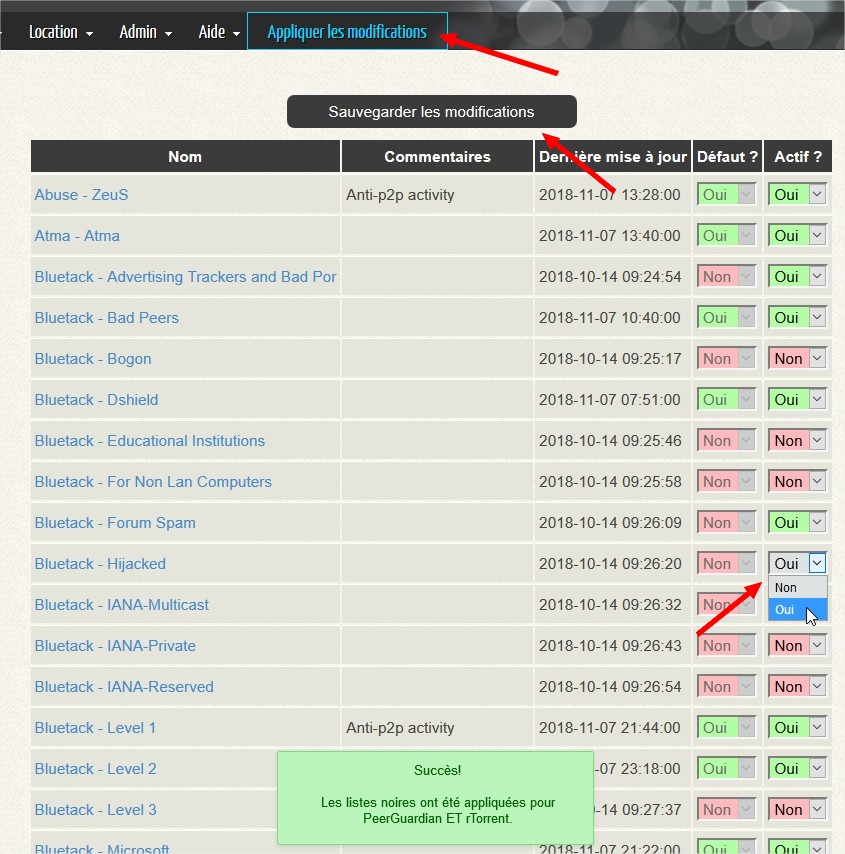

# Les listes noires

## Pour commencer

Les listes noires _\(ou listes de blocage\)_ sont des listes d'adresses IP classées par catégories.   
Ces listes sont exploitées par l'outil PeerGuardian et/ou rTorrent dans le but de bloquer l'accès à votre serveur aux catégories d'adresses IP sélectionnées _\(organismes gouvernementaux, organisations maveillantes, organisations anti P2P, ...\)_.

Certaines catégories ont été sélectionnées par défaut pour obtenir un compromis entre sécurité et partage des données.   
Les listes de blocage de PeerGuardian et rTorrent sont exploitées distinctement.

Si vous avez choisi d'installer PeerGuardian, alors votre serveur sera complètement protégé.  
Les listes pour rTorrent ne seront pas utilisées SAUF dans 2 situations:

* **SI** PeerGuardian n'est pas installé
* **SI** PeerGuardian a planté ou si le service ne démarre pas

## Gestion des listes via le portail


Il n'est pas possible d'ajouter de nouvelles listes noires à celles déjà présentes.


Pour gérer vous-même les listes existantes, rien de plus simple.

* menu **Liste noires** &gt; **PeerGuardian**
* menu **Liste noires** &gt; **rTorrent**

Pour faciliter une certaine cohérence, toute modification appliquée dans la liste noire de PeerGuardian sera répercutée dans celle de rTorrent, et vice versa.  
En effet, une grosse majorité des listes présentes pour PeerGuardian sont les mêmes pour rTorrent.

Chacune des listes présentes, dispose d'un lien pointant sa description sur le site de [I-Blocklist](https://www.iblocklist.com/).

Pour activer/désactiver une liste, sélectionnez **Oui** ou **Non** dans la colonne **Actif ?**.  
Cliquez sur **Sauvegarder les modifications**, puis **Appliquer les modifications**.


Si vous avez un doute quant au choix des listes à activer, alors laissez celles par défaut.


## Avertissements


N'ajouter pas vos ports rTorrent dans la liste des ports entrants autorisés dans PeerGuardian _\(pglcmd.conf_\) !!!  
Utiliser PeerGuardian n'aura pas beaucoup de sens sinon...



NE modifiez PAS la configuration de PeerGuardian manuellement.  
Toutes les modifications appliquées manuellement seront effacées par le fonctionnement de le système.



Les règles IPtables sont générées dynamiquement, incluant celles de PeerGuardian, Fail2Ban, ainsi que des règles spécifiques à MySB.  
Toutes les modifications appliquées manuellement seront effacées par le fonctionnement de le système.


