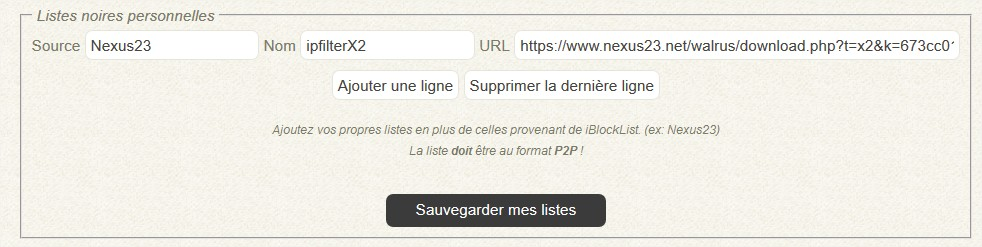

# Les listes noires

## Pour commencer

Les listes noires _\(ou listes de blocage\)_ sont des listes d'adresses IP classées par catégories.   
Ces listes sont exploitées par l'outil PeerGuardian et/ou rTorrent dans le but de bloquer l'accès à votre serveur aux catégories d'adresses IP sélectionnées _\(organismes gouvernementaux, organisations malveillantes, organisations anti P2P, ...\)_.

Certaines catégories ont été sélectionnées par défaut pour obtenir un compromis entre sécurité et partage des données.   
Les listes de blocage de PeerGuardian et rTorrent sont exploitées distinctement.

Si vous avez choisi d'installer PeerGuardian, alors votre serveur sera complètement protégé.  
Les listes pour rTorrent ne seront pas utilisées SAUF dans 2 situations:

* **SI** PeerGuardian n'est pas installé
* **SI** PeerGuardian a planté ou si le service ne démarre pas

## Gestion des listes via le portail

2 types de listes sont maintenant présentes:

* menu **Liste noires** &gt; **Listes noires usuelles**
* menu **Liste noires** &gt; **Listes noires par pays**

Chacune des listes présentes, dispose d'un lien pointant sa description sur le site de [I-Blocklist](https://www.iblocklist.com/).

### Listes noires usuelles

#### Abonnement i-Blocklist

Vous pouvez afficher et gérer les listes payantes du site [I-Blocklist](https://www.iblocklist.com/).  
Pour cela, saisissez vôtre nom d'utilisateur et le code PIN associé.

#### Listes personnelles _\(ex: Nexus23\)_

_Vous pouvez également ajouter vos propres listes comme celles provenant de Nexus23 par exemple._

La **Source** est un champs permettant d'identifier personnellement vos listes. Mettez ce que vous voulez. _\(ex: Nexus23\)_.  
Le **Nom** de vôtre liste. _\(ex:  ipfilterX2\)_  
L'**URL** par contre doit être valide et contenir directement les éventuels identifiants d'accès à la liste.  
_\(ex: https://www.nexus23.net/walrus/download.php?t=x2&k=xxxxxxxxxxxxxxxxxxxxxxxxxxxxx\)_

#### Activation / Désactivation

Pour activer/désactiver une liste, sélectionnez **Oui** ou **Non** dans la colonne **Actif ?**.  
Cliquez sur **Sauvegarder les modifications**, puis **Appliquer les modifications**.


Si vous avez un doute quant au choix des listes à activer, alors laissez celles par défaut.



Envisagez à la souscription pour des listes payantes sur [i-Blocklists](https://www.iblocklist.com/) ou à une liste [ipfilterX sur Nexus23](https://ipfilterx.com/subscribe/) !


### Listes noires par pays

Pour activer/désactiver une liste, sélectionnez **Oui** ou **Non** dans la colonne **Actif ?**.  
Cliquez sur **Sauvegarder les modifications**, puis **Appliquer les modifications**.


Si vous avez un doute quant au choix des listes à activer, alors laissez celles par défaut.



Législation du P2P par pays: [https://www.vpnmentor.com/blog/torrents-illegal-update-country/](https://www.vpnmentor.com/blog/torrents-illegal-update-country/)


## Avertissements


**N**'ajouter **PAS** vos ports rTorrent dans la liste des ports entrants autorisés dans PeerGuardian _\(pglcmd.conf_\) !!!  
Utiliser PeerGuardian n'aura pas beaucoup de sens sinon...



**NE** modifiez **PAS** la configuration de PeerGuardian manuellement.  
Toutes les modifications appliquées manuellement seront **effacées** par le fonctionnement de le système.



Les règles IPtables sont générées dynamiquement, incluant celles de PeerGuardian, Fail2Ban, ainsi que des règles spécifiques à MySB.  
Toutes les modifications appliquées manuellement seront effacées par le fonctionnement du  système.


