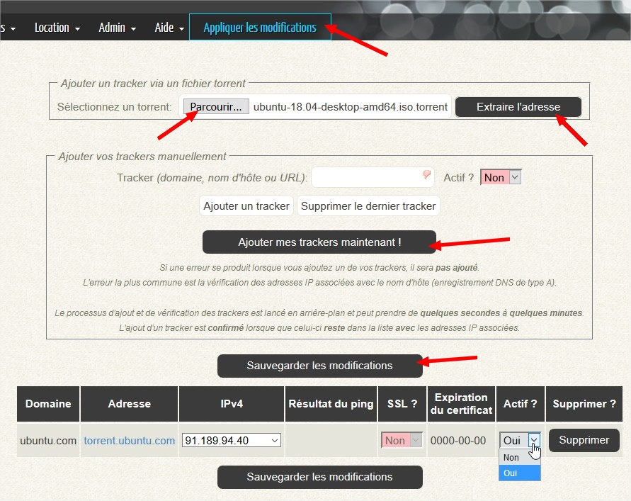

# Les trackers

## Globalement

Une liste de trackers a été générée lors  de l'installation de MySB, en utilisant les sources de ruTorrent.
Les trackers présents dans cette liste ne sont pas modifiables. Il est seulement possible de les activer ou de les désactiver.

Vous avez également la possibilité d'ajouter vos propres trackers, qui s'afficheront ensuite dans la liste globale.

Techniquement, tous les trackers fonctionnent sans avoir besoin de les ajouter.
L’intérêt d'en ajouter réside dans la possibilité de les bloquer par la suite si vous ne souhaitez pas qu'il y ait de trafic eux. C'est utile si vous souhaitez n'utiliser que des trackers privés, et non des publiques.
Si vous voulez bloquer l'utilisation d'un tracker en particulier, il suffit de l'ajouter **ET** de le **désactiver**.
Les connexions vers ce tracker seront alors bloquées.

Pour permettre un certain contrôle sur l'utilisation de nouveaux trackers par les autres utilisateurs de vôtre serveur, une tâche programmée _\(_[_GetTrackersCert.bsh_](https://mysb.gitbook.io/dov5.4_fr3_fr/le-portail/binaires-and-scripts)_\)_ lira tous les fichiers .torrent de tout le monde pour en extraire le nom du tracker.
Si celui-ci n'existe pas dans la liste, alors il y sera ajouté et vous recevrez un mail pour vous avertir.
A vous ensuite, de le désactiver ou non.

La liste globale est accessible via le menu **Trackers** &gt; **Liste des trackers**.

## Ajout manuel d'un nouveau tracker

L'ajout d'un tracker se fait en passant par le menu **Trackers** &gt; **Mes trackers**.

Seul l'utilisateur principal pour ajouter un tracker, vous devrez donc vous identifier.

Si vous n'êtes pas certain de l'adresse du tracker, ou que vous ne voulez pas éditer le fichier .torrent pour vérifier, j'ai ajouté une fonction qui le fera pour vous 😉 .

Pour cela:

1. cliquez sur **Parcourir** dans le cadre **Ajouter un tracker via un fichier torrent**;
2. sélectionnez le .torrent en question sur vôtre PC;
3. cliquez sur **Extraire l'adresse**;

L'adresse du tracker sera automatiquement ajoutée dans le champs **Tracker**, présent dans le cadre **Ajouter vos trackers manuellement**.

Il en vous reste plus qu'à confirmer l'ajout et à confirmer s'il doit être actif ou non.

1. sélectionnez **Oui** ou **Non** devant **Actif ?**
2. cliquez sur **Ajouter mes trackers maintenant !**
3. cliquez sur **Sauvegarder les modifications**
4. Puis sur **Appliquer les modifications**

Une fois le tracker ajouté, une vérification va être lancée pour vérifier plusieurs choses.

* gestion des connexions en HTTPs, avec la date d'expiration du certificat SSL;
* les adresses IP liées à l'adresse du tacker;
* activité du tracker _\(PING\)_

## Ajout automatique/détection de nouveaux trackers

Le script [GetTrackersCert.bsh](https://mysb.gitbook.io/doc/v/v5.4_fr/mysb-en-detail/binaires-and-scripts#les-scripts-usuels), exécuté tous les jours à 10h00, liste tous les .torrents actifs de tous les utilisateurs pour en extraire les annonceurs HTTP.
Une vérification est ainsi faite sur chaque tracker pour ensuite l'ajouter à la liste dans le portail.

Chaque tracker ajouté est automatiquement activé.
L'obtention du certificat SSL du tracker est également effectué.

A vous, ensuite, de décider si vous devez le laisser actif ou nom.
