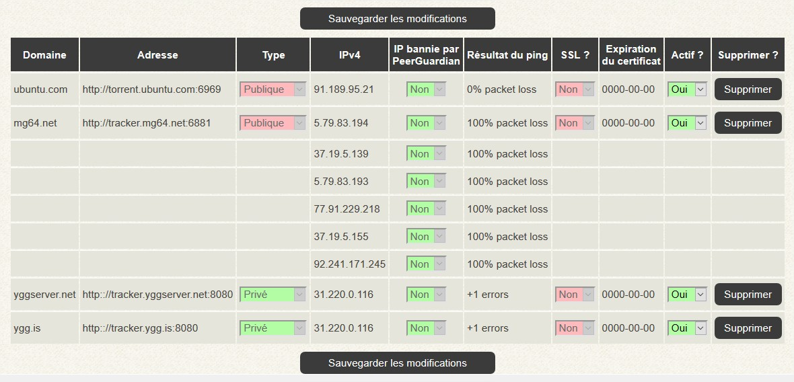

# Les trackers

## Les annonceurs

Chaque fichier torrent contient ce que l'on appel un annonceur, une URL précisant où trouver les peers des fichiers à télécharger. Il y en a toujours au moins 1, lié généralement au tracker lui-même _\(ex: http://tracker.domain.com/annonce\)_, cas pour les trackers **privés**.

Pour certains trackers, généralement pour les **publiques** ou **semi-privés**, il peut y avoir de multiples annonceurs dans un même fichier torrent. Des URL pointant vers des serveurs parfois étrangers et ne garantissant pas forcément une grande sécurité.

Les adresses IP liées aux URL de ces annonceurs peuvent faire partie de listes de blocages générées par I-Blocklist _\(PeerGuardian\)_.

De ce fait, chaque torrent ajouté à votre serveur sera vérifié pour être analysé pour détecter toute présence dans une éventuelle liste de blocage, et le désactiver le cas échéant.

## Globalement

Les nouveaux trackers seront automatiquement ajoutés dès le chargement d'un fichier torrent. Vous n'avez plus besoin de les ajouter manuellement pour gérer leur activation.

Techniquement, tous les trackers fonctionnent sans avoir besoin de les ajouter. L’intérêt d'en ajouter réside dans la possibilité de les bloquer par la suite si vous ne souhaitez pas qu'il y ait de trafic avec eux. C'est utile si vous souhaitez n'utiliser que des trackers privés, et non des publiques. Si vous voulez bloquer l'utilisation d'un tracker en particulier, il suffit de l'ajouter **ET** de le **désactiver**. Les connexions vers ce tracker seront alors bloquées.

Pour permettre un certain contrôle sur l'utilisation de nouveaux trackers par les autres utilisateurs de vôtre serveur, une tâche programmée _\(_[_GetTrackersCert.bsh_](binaires-and-scripts.md#les-scripts-usuels)_\)_ lira tous les fichiers .torrent de tout le monde pour en extraire le nom du tracker. Si celui-ci n'existe pas dans la liste, alors il y sera ajouté et vous recevrez un mail pour vous avertir. A vous ensuite, de le désactiver ou non.

La liste globale est accessible via le menu **Trackers** &gt; **Liste des trackers**.

## Ajout automatique/détection de nouveaux trackers

Le script [GetTrackersCert.bsh](binaires-and-scripts.md#les-scripts-usuels), exécuté tous les jours à 10h00, liste tous les .torrents actifs de tous les utilisateurs pour en extraire les annonceurs HTTP. Une vérification est ainsi faite sur chaque tracker pour ensuite l'ajouter à la liste dans le portail.

Chaque tracker ajouté est automatiquement activé. L'obtention du certificat SSL du tracker est également effectué.

A vous, ensuite, de décider si vous devez le laisser actif ou nom.

