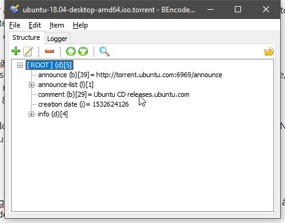

# Requêtes DNS

## Les requêtes DNS

Je ne suis pas un expert. Mais j'ai quelques bases.

A partir de vôtre ordinateur ou serveur, lorsque vous souhaitez accéder à un site, à un autre serveur ou autre, en utilisant un nom d'hôte _\(toto.titi-tata.com\)_, pour tous les protocoles _\(SSH, HTTP, HTTPs, FTP, ...\),_   
une résolution de l'adresse IP se cachant derrière ce nom d'hôte est faite.  
Car vous n'accéderez nulle part si aucune adresse IP n'est liée à ce nom d'hôte.

Pour que cette résolution soit possible, nous utilisons des [DNS ou Domain Name System](https://fr.wikipedia.org/wiki/Domain_Name_System).  
Ces DNS sont des adresses IP ajoutées dans nos routeurs, ordinateurs, serveurs pour nous indiquer qui nous fera la résolution nom d'hôte/adresse IP.  
Ces DNS sont ceux de nos fournisseurs d'accès Internet, hébergeurs ou même des services privés ou publiques comme Google par exemple.  
J'imagine que vous connaissez, entre autre, les DNS de Google _\(8.8.8.8 ou 8.8.4.4\)_ ?

Les DNS fonctionnent parfois de manière récursive. C'est à dire qu'on donne à nos systèmes un DNS local qui lui-même interrogera un DNS extérieur.  
Par exemple, on trouve souvent dans la majorité des foyers, une configuration de ce type.

**DNS du PC**: 192.168.1.1 _\(ex: adresse IP du routeur Orange\)_  
**DNS routeur**: 80.10.246.2 et 80.10.246.129 _\(serveurs DNS d'Orange\)_

Dans la majorité des cas, pour des DNS communs tels que nos FAI ou Google, les requêtes que nous faisons sont enregistrées pour être utilisées à des fins commerciales.  
Ou même bloquées à des fins de filtrage pour bloquer l'accès à certaines destinations.  
Cela a été la méthode utilisée pour bloquer l'accès au site Pirate Bay à un moment donné par exemple.

Ce qu'il faut retenir, c'est qu'il se passe énormément de chose entre nos machines et Internet.  
Et ce n'est pas parce que vous ne voyez rien, qu'il ne se passe rien.

Pour l'utilisation de fichiers torrent, et bien c'est la même chose...  
Un fichier torrent contient au moins 1 URL indiquant où trouver les sources des fichiers.

Par exemple, voici le contenu d'un fichier torrent Ubuntu.

Donc, quand vous ajoutez un torrent dans vôtre SeedBox, et bien une requête DNS est effectuée pour obtenir l'adresse IP de destination.  
Cette requête peut donc être enregistrée ou filtrée par les DNS que vous utilisés.  
Est-ce bien bien ou pas, selon vous ?

Même s'il n'est pas toujours possible de savoir ce que vous voulez récupérer, il est néanmoins possible de savoir chez qui vous allez et d'où ça part.  
L'usage du HTTPs dans les torrents est donc aussi intéressante, mais ce n'est pas le sujet.

C'est là que [DNScrypt-proxy](https://dnscrypt.info/) joue un rôle non négligeable, protéger les requêtes DNS qui sortent de vôtre SeedBox.

## DNScrypt-proxy

Un certain nombre de serveur DNS _\(resolvers\)_ spécifiques à cet usage, sont référencés, précisant au moins 2 critères liés à la sécurité _\(DNSsec et Logging\)_.  
Je ne détaillerais pas [DNSsec](https://fr.wikipedia.org/wiki/Domain_Name_System_Security_Extensions).  
Le critère Logging indiquera si le resolver conservera vos requêtes DNS ou non. Ça peut être sympa...

DNSCrypt est un protocole qui authentifie les communications entre un client _\(vos équipements\)_ et un résolveur DNS. Il empêche l'usurpation DNS _\(_[_DNS spoofing_](https://www.securiteinfo.com/attaques/hacking/dnsspoofing.shtml)_\)_. Il utilise des signatures cryptographiques pour vérifier que les réponses proviennent du résolveur DNS choisi et n’ont pas été falsifiées.

Il s’agit d’une spécification ouverte, avec implémentations de référence libres et à source ouverte, et n’est affiliée à aucune société ni organisation.

Des résolveurs gratuits compatibles avec DNSCrypt sont disponibles dans le monde entier.

Voici 2 liens listant les résolveurs gratuits compatibles DNScrypt:

* [Liste interactive des serveurs DNS publiques](https://dnscrypt.info/public-servers)
* [Carte interactive des serveurs DNS publiques](https://dnscrypt.info/map)

