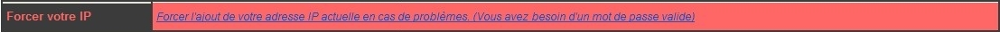

# FAQ

## Administrateur

### Système

#### Problème de droits sur des fichiers ou dossiers

Vous ne pouvez plus exécuter les commandes MySB\_\*\*\* ?  
Ou vous avez des problèmes d'accès à certains services ?

Lancez ces commandes suivantes, cela restaurera tous les droits où il faut.

`. /opt/MySB/inc/vars  
gfnManageDirAndFiles 'global'`

#### Changer le nom de vôtre serveur

```text
. /opt/MySB/inc/vars
. /opt/MySB/inc/funcs_by_script/funcs_Upgrade
gfnChangeFQDN
```

### Les 5% de blocs réservés

Par défaut, 5% des blocs du système de fichiers sont réservés et ne peuvent être écrits. Ils sont réservés en "secours" et utilisables uniquement par root.  
Si le système de fichier est grand _\(ex: 1To\)_ ça fait quand même 50Go, surtout si on stocke des données c'est pas utile.  
Mettre à 0% c'est pas l'idéal, mais on peut mettre cette valeur à 1% par exemple.

#### Obtention des infos actuelles

```text
dumpe2fs -h /dev/sda1 | grep -i 'block count'

dumpe2fs 1.43.4 (31-Jan-2017)
Block count:              5016832
Reserved block count:     250841
```

#### Calcul du pourcentage actuel utilisé

_Nombre de blocs réservés / Nombre de blocs \* 100 = Pourcentage réservé_

**Ex**: 250841 / 5016832 \* 100 = 4,9999880402612644792570291371128 _**\(~5%\)**_

#### Changer le pourcentage de bloc réservé à 1%

```text
tune2fs -m 1 /dev/sda1
```

#### Vérification

```text
dumpe2fs -h /dev/sda1 | grep -i 'block count'

dumpe2fs 1.43.4 (31-Jan-2017)
Block count:              5016832
Reserved block count:     50168
```

_Nombre de blocs réservés / Nombre de blocs \* 100 = Pourcentage réservé_

**Ex**: 50168 / 5016832 \* 100 = 0,99999362147267438893708220646017 _**\(~1%\)**_

Pour résumer, il suffit d'utiliser la commande _tune2fs -m **X** /dev/**partition**_, où **X** correspond au pourcentage désiré.


**NE PAS mettre à 0% cet espace réservé !**


### Réseau

#### L'adresse IP d'un utilisateur a été bannis par Fail2Ban, par utilisation répétée d'un mauvais mot de passe

Il est nécessaire de restaurer les règles de sécurité par défaut. De cette manière, les bannissements seront purgés.

`MySB_SecurityRules create`

### Web

#### Je souhaite ajouter un site perso

Il est possible d'héberger un site perso avec MySB, cependant, la gestion restera manuelle. Les ports 80 et 443 pourront être utilisés.

#### Créer une entrée dans NginX

```bash
vi /etc/nginx/sites-available/mon_site

#### Mon site (HTTPs)
server {
        listen 443 default_server ssl http2;
        server_name "mon_site.mon_domaine.org";
        index index.php;
        charset utf-8;

        include snippets/letsencrypt_mon_site.mon_domaine.org.conf;

        access_log /var/log/nginx/mon_site-access.log anonymized;
        error_log /var/log/nginx/mon_site-error.log error;

        root /var/www/html;

        include /etc/nginx/conf.d/static_files;
        include /etc/nginx/conf.d/global_deny_access;
        location ~ \.php$ {
                include /etc/nginx/conf.d/php-ssl;
        }
}

#### Mon site (HTTP)
server {
        listen 80 default_server http2;
        server_name "mon_site.mon_domaine.org";
        index index.php;
        charset utf-8;

        access_log /var/log/nginx/mon_site-access.log anonymized;
        error_log /var/log/nginx/mon_site-error.log error;

        root /var/www/html;

        include /etc/nginx/conf.d/static_files;
        include /etc/nginx/conf.d/global_deny_access;
        location ~ \.php$ {
                include /etc/nginx/conf.d/php;
        }
}
```


Les fichiers de votre site internet devront se trouver dans le dossier _**/var/www/html**_.


#### Activer le nouveau site avec Nginx

```bash
[[ ! -L /etc/nginx/sites-enabled/mon_site ]] && ln -s /etc/nginx/sites-available/mon_site /etc/nginx/sites-enabled/mon_site
service nginx restart
```

#### Ajouter un FQDN pour Let's Encrypt

```bash
echo "mon_site.mon_domaine.org" >> /opt/MySB/ssl/letsencrypt_domains
/bin/bash /opt/MySB/install/LetsEncrypt renew
```


Pensez à supprimer les FQDN qui ne sont plus valides dans le fichier _**/opt/MySB/ssl/letsencrypt\_domains**_ !


## Utilisateurs

### Réseau

#### Vôtre adresse IP a changé et vous n'êtes plus autorisé à vous connecter.

Dans chacun des mails envoyés par MySB _\(contenant MySB dans l'objet...\)_, vous disposez d'un lien permettant de forcer l'ajout d'une nouvelle adresse IP.  
Vous devrez vous identifier pour pouvoir en ajouter une nouvelle.



L'URL permettant d'ajouter de nouvelles adresses autorisées est formatée ainsi:

[**https://**demo-mysb.dyndns.org:8189**/ForceAddress?page=ManageAddresses**](https://demo-mysb.dyndns.org:8189/ForceAddress?page=ManageAddresses)\*\*\*\*


_**Note**: Faites bien attention d'activer vôtre nouvelle adresse avant d'enregistrer vos modifications._



